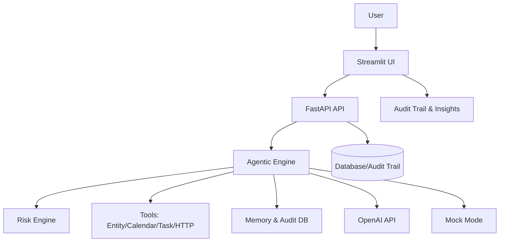

<div align="center">

# 🤖 AI Agentic Compliance Assistant

### *Intelligent compliance automation with human oversight*

[](https://www.python.org/downloads/)
[](https://fastapi.tiangolo.com/)
[](https://streamlit.io/)
[](https://opensource.org/licenses/MIT)
[]()

[🚀 Quick Start](#-quick-start) • [📖 Documentation](#-documentation) • [🎯 Features](#-core-agentic-features) • [🏗️ Architecture](#-architecture)

---

</div>

**One-liner:** Agentic FastAPI + Streamlit stack that analyzes compliance tasks, decides when to escalate, and logs every decision with transparent plan/execute/reflect traces.

## 📋 Executive Summary

The **AI Agentic Compliance Assistant** is an intelligent system that autonomously handles routine compliance tasks while intelligently escalating high-risk scenarios to human experts. Built with cutting-edge agentic AI capabilities, it combines a **6-factor risk assessment engine**, **persistent entity memory**, **human feedback learning**, **proactive recommendations**, and **counterfactual reasoning** to deliver transparent, auditable compliance decisions.

**Current State (truthful):**
- Demo-first build with mock-mode support (OpenAI key optional; real key recommended for production).
- Small test suite in `tests/` (coverage not reported); expand before production use.
- Default demo login: Username `demo`, Password `demo123` — replace with real auth + secrets in production.
- Complete audit trail path is wired, but database/LLM configs must be supplied via env.
- Advanced features (EpisodicMemory, SemanticMemory, ScoreAssistant) are planned, not shipped.

**Use it for:** Portfolio demos, architecture exploration, and a starting point for hardened deployments (add real secrets, DB, auth, and more tests before production).

---

## 🏗️ Architecture

### System Overview



### Agentic Workflow

The system implements a **Plan → Execute → Reflect** agentic loop:

- User submits a task from the dashboard (`/api/v1/agentic/analyze`).
- Orchestrator builds a 3–7 step plan (mock responses if no OpenAI key; live LLM if provided).
- For each step: execute tools (Entity, Calendar, Task, HTTP), capture outputs, and reflect; replan if quality < 0.75.
- Persist results to memory/audit trail and return decision outcome (AUTONOMOUS, REVIEW_REQUIRED, ESCALATE) with rationale and confidence.

---

## ✨ Core Agentic Features

### 1. 🎯 6-Factor Risk Assessment Engine

Evaluates compliance tasks across six weighted dimensions to determine autonomy level:

| Factor | Weight | Evaluates |
|--------|--------|-----------|
| **Jurisdiction Complexity** | 15% | Multi-regulatory framework analysis (GDPR, HIPAA, SOX, etc.) |
| **Entity Risk Profile** | 15% | Organization history, violations, maturity |
| **Task Complexity** | 20% | Categorization from inquiries to filings |
| **Data Sensitivity** | 20% | PII, financial data, special categories |
| **Regulatory Oversight** | 20% | Direct regulation status and enforcement |
| **Impact Severity** | 10% | Stakeholder count, financial consequences |

**Outcome Mapping:**
- Risk < 0.4 → **AUTONOMOUS** ✅ (Agent proceeds independently)
- Risk 0.4-0.7 → **REVIEW_REQUIRED** ⚠️ (Human approval needed)
- Risk > 0.7 → **ESCALATE** 🚨 (Expert involvement required)

### 2. 🧠 Entity Memory System

Maintains persistent memory of every organization's compliance journey:
- **Compliance History** — All past decisions and outcomes
- **Violation Records** — Previous failures with remediation tracking
- **Risk Evolution** — Score progression over time
- **Trend Analysis** — Improving vs. declining compliance patterns
- **Personalized Adjustments** — Entity-specific risk calibration

### 3. 🔄 Human Feedback Loop

Continuous learning mechanism that improves from human corrections:
- **Decision Overrides** — Track when humans change AI decisions
- **Factor Corrections** — Capture specific risk factor adjustments
- **Pattern Recognition** — Identify systematic assessment gaps
- **Threshold Tuning** — Auto-adjust autonomy thresholds based on accuracy
- **Memory Updates** — Store feedback for future reference

### 4. 💡 Proactive Suggestion Engine

Shifts compliance from reactive to predictive:

| Type | Trigger | Example |
|------|---------|---------|
| **Deadline Monitoring** | Obligation within 30 days | "SOX audit due in 14 days" |
| **Regulatory Changes** | New law published | "GDPR amendments effective March 2025" |
| **Risk Patterns** | Multiple similar incidents | "3 data breaches in 30 days - suggest training" |
| **Preventive Actions** | Rising risk trend | "Entity risk up 25% - schedule audit" |
| **Violations** | Recent violations detected | "2 violations in 60 days - escalate review" |

### 5. 🔍 Counterfactual Reasoning (What-If Analysis)

Generates "what-if" scenarios to explain decision boundaries:
- **Factor Deltas** — Shows how changing one factor affects the score
- **Decision Boundaries** — Identifies threshold values that change decisions
- **Scenario Comparison** — Compare multiple scenarios side-by-side
- **Transparency** — Explains why decisions were made

**Example:**
```
Original: Small startup (50 employees) → AUTONOMOUS (score: 0.35)
What-If: "What if 10,000 employees?"
Result: REVIEW_REQUIRED (score: 0.65)
Changed Factors: [regulatory_oversight +0.3, impact_severity +0.2]
```

---

## 🚀 Quick Start

### Prerequisites

- **Python 3.11 or higher** ([Download](https://www.python.org/downloads/))
- **OpenAI API key** (optional - system works in mock mode without it)
- **Terminal/Command Prompt** access
- **10 minutes** of your time
- If you skip `OPENAI_API_KEY`, all LLM calls use deterministic mock responses (no cost).

### Installation & Setup

#### Step 1: Clone and Setup Environment

```bash
# 1. Clone repository
git clone https://github.com/walvekarn/agentic-compliance-agent.git
cd agentic-compliance-agent

# 2. Create virtual environment
python3 -m venv venv

# 3. Activate virtual environment
source venv/bin/activate  # On macOS/Linux
# OR
venv\Scripts\activate     # On Windows
```

#### Step 2: Install Dependencies

```bash
# Install dependencies
pip install -r requirements.txt
```

#### Step 3: Configure Environment Variables

```bash
# Copy example environment file
cp .env.example .env

# Edit .env and fill in required values (see .env.example)
# Optional: set OPENAI_API_KEY for live LLM calls; leave empty for mock mode.
# Use any text editor:
nano .env  # or vim, notepad, VS Code, etc.

# (Optional) Streamlit secrets for the dashboard
cp frontend/secrets.toml.example frontend/secrets.toml
# Update login_password before production; file remains local and gitignored.
```

**Note:** The system works in **mock mode** without an API key for testing and demos. Real API key enables full LLM-powered agentic features.

#### Step 4: Initialize Database

```bash
# Database will auto-initialize on first run, or manually:
python -c "from backend.db.base import Base, engine; from backend.db import models; Base.metadata.create_all(bind=engine)"
```

#### Step 5: Start the System

**Option A: Using Makefile (Recommended)**
```bash
make start
```

**Option B: Manual Start (Two Terminals)**

Terminal 1 - Backend:
```bash
cd /path/to/agentic-compliance-agent
uvicorn backend.main:app --host 0.0.0.0 --port 8000 --reload
```

Terminal 2 - Dashboard:
```bash
cd /path/to/agentic-compliance-agent
streamlit run frontend/Home.py --server.port 8501
```

### ✅ Verify Installation

1. **Backend Health Check:**
   ```bash
   curl http://localhost:8000/health
   ```
   Should return:
   ```json
   {
     "status": "healthy",
     "version": "1.3.0-agentic-hardened",
     "timestamp": "2025-12-12T14:00:00Z (example)",
     "components": {
       "database": {"status": "healthy", "type": "sqlite"},
       "openai": {"status": "not_configured", "key_present": false, "note": "Agentic features will use mock mode"},
       "auth": {"status": "development_mode", "warning": "Using default JWT secret"}
     }
   }
   ```

2. **Open Dashboard:**
   Navigate to http://localhost:8501 in your browser

3. **Login:**
   - Default credentials: Username `demo`, Password `demo123` (update for production)

4. **Run Tests (Optional):**
   ```bash
   pytest -v
   ```
   Should show: `84+ passed`

### 🎯 Quick Demo (2 minutes)

1. **Login** with Username `demo`, Password `demo123`
2. Click **"Analyze Task"** in the sidebar
3. Fill out the form:
   - Entity: "Test Company"
   - Type: "Private Company"
   - Industry: "Technology"
   - Employee count: 50
   - Task: "Review privacy policy for GDPR compliance"
4. Click **"Analyze Task"**
5. See AI decision in seconds! ✨

### 🔗 Access Points

- **🎨 Dashboard:** http://localhost:8501
- **🔌 Backend API:** http://localhost:8000
- **📚 Interactive API Docs:** http://localhost:8000/docs
- **📖 API Reference:** http://localhost:8000/redoc
- **🔐 Demo login:** Username `demo`, Password `demo123`

---

## 📸 Screenshots

Screenshots are not included in this release. Run the app locally (`make start`) to explore the UI. The dashboard focuses on 5 core pages:
- **Home** - Project overview and quick start
- **Analyze Task** - Single task analysis with 6-factor risk model
- **Audit Trail** - Complete decision history and statistics
- **Agentic Analysis** - Advanced plan-execute-reflect workflow
- **Agentic Test Suite** - Comprehensive test scenarios

---

## 🔌 API Endpoints

### Authentication

```
POST   /auth/login              # User login
POST   /auth/register           # User registration (if enabled)
POST   /auth/refresh            # Refresh JWT token
GET    /auth/me                 # Get current user info
```

### Decision Analysis

```
POST   /api/v1/decision/analyze           # Analyze single compliance task
POST   /api/v1/decision/batch-analyze     # Batch analysis (multiple tasks)
POST   /api/v1/decision/quick-check        # Fast risk check (lightweight)
GET    /api/v1/decision/risk-levels       # Get risk level information
POST   /api/v1/decision/what-if           # What-if scenario analysis
POST   /api/v1/decision/what-if/compare   # Compare multiple scenarios
POST   /api/v1/decision/triggers/check    # Check proactive suggestion triggers
```

### Agentic AI Engine

```
POST   /api/v1/agentic/analyze            # Advanced agentic analysis (plan-execute-reflect)
GET    /api/v1/agentic/status            # Agentic engine status and configuration
GET    /api/v1/agentic/health/full        # Comprehensive health check
POST   /api/v1/agentic/testSuite          # Run test suite
POST   /api/v1/agentic/benchmarks        # Run benchmark suite
POST   /api/v1/agentic/recovery           # Error recovery simulation
```

**Agentic Analysis Features:**
- 🎯 Strategic task planning (3-7 steps)
- ⚙️ Tool-augmented execution (Entity, Calendar, Task, HTTP)
- 🔍 Quality reflection and iteration
- 🧠 Memory systems integration
- 💡 Transparent reasoning chains
- 🔄 Replanning on low quality scores

### Entity Management

```
POST   /api/v1/entity/analyze             # Analyze entity + generate compliance calendar
GET    /api/v1/entity/history/{entity}     # Entity compliance history
GET    /api/v1/audit_log/{task_id}        # Get audit log for specific task
```

### Audit Trail

```
GET    /api/v1/audit/entries              # Get audit entries (with filters)
GET    /api/v1/audit/entries/{audit_id}   # Get specific audit entry
GET    /api/v1/audit/statistics           # Audit statistics and metrics
GET    /api/v1/audit/export/json          # Export audit trail as JSON
GET    /api/v1/audit/filters              # Get available filter options
GET    /api/v1/audit/recent               # Get recent audit entries
GET    /api/v1/audit/entity/{entity_name} # Get audit entries for entity
```

**Filter Parameters:**
- `limit`, `offset` - Pagination
- `agent_type` - Filter by agent type
- `entity_name` - Filter by entity
- `decision_outcome` - Filter by decision (AUTONOMOUS/REVIEW_REQUIRED/ESCALATE)
- `risk_level` - Filter by risk (LOW/MEDIUM/HIGH)
- `task_category` - Filter by task category
- `start_date`, `end_date` - Date range filter

### Feedback & Learning

```
POST   /api/v1/feedback                    # Submit decision feedback
GET    /api/v1/feedback                    # Get all feedback entries
GET    /api/v1/feedback/stats              # Feedback statistics
GET    /api/v1/feedback/{feedback_id}      # Get specific feedback entry
GET    /api/v1/feedback/overrides          # Get override tracking statistics
```

### Compliance Chat

```
POST   /api/v1/query                       # Natural language compliance query
GET    /api/v1/queries                     # Get query history
POST   /api/v1/rules                       # Add compliance rule
GET    /api/v1/rules                       # Get all rules
GET    /api/v1/rules/{rule_id}             # Get specific rule
```

### System

```
GET    /health                             # Health check (basic)
GET    /docs                               # Swagger UI (interactive API docs)
GET    /redoc                              # ReDoc (alternative API docs)
```

**Interactive Documentation:** Visit http://localhost:8000/docs for full API playground with request/response examples.

---

## 🧪 Demo Instructions

### Basic Demo (5 minutes)

**Goal:** Show core risk assessment and decision-making

1. **Start System**
   ```bash
   make start
   ```

2. **Navigate to Dashboard**
   - Open http://localhost:8501
   - Login with Username `demo`, Password `demo123`

3. **Analyze a Simple Task**
   - Go to "Analyze Task" page
   - Enter:
     - Entity: "Demo Corp"
     - Type: "Private Company"
     - Industry: "Technology"
     - Employees: 50
     - Task: "Review privacy policy"
   - Click "Analyze Task"
   - **Show:** Risk score, decision, rationale

4. **View Audit Trail**
   - Go to "Audit Trail" page
   - **Show:** Complete decision history
   - Filter by entity or decision type
   - Show statistics and charts

### Advanced Demo (10 minutes)

**Goal:** Show agentic AI capabilities

1. **Agentic Analysis**
   - Go to "Agentic Analysis" page
   - Enter same task as above
   - Click "Run Agentic Analysis"
   - **Show:**
     - Plan generation (3-7 steps)
     - Tool execution
     - Reflection scores
     - Final recommendation

2. **What-If Analysis**
   - Go to "Analyze Task" page
   - After analysis, use "What-If" feature
   - Change employee count from 50 to 10,000
   - **Show:** How decision changes

3. **Feedback Loop**
   - Go to "Analyze Task" page
   - After analysis, provide feedback
   - **Show:** How feedback updates memory

### Mock Mode Demo (No API Key Required)

The system works in **mock mode** without an OpenAI API key:

1. **Start without API key**
   ```bash
   # Don't set OPENAI_API_KEY in .env
   make start
   ```

2. **Run Agentic Analysis**
   - System uses mock responses
   - Shows complete workflow
   - Demonstrates architecture

3. **Benefits:**
   - No API costs
   - Fast execution
   - Perfect for demos
   - Shows system architecture

---

## ⚠️ Disclaimers

### MVP Scope

This is a **Minimum Viable Product (MVP)** with the following scope:

**✅ Included:**
- Core 6-factor risk assessment engine
- Basic agentic AI workflow (plan-execute-reflect)
- Entity memory system
- Human feedback loop
- Proactive suggestions
- What-if analysis
- Complete audit trail
- Streamlit dashboard (5 core pages focused on agentic AI)
- FastAPI backend with JWT auth
- SQLite database (PostgreSQL-ready)
- Comprehensive test suite (measured coverage ~33%)
- Mock mode for testing without API key

**❌ Not Included (Future Roadmap):**
- Production-grade security hardening
- Role-based access control (RBAC)
- Multi-tenant architecture
- Advanced memory persistence
- Fine-tuned compliance models
- Document upload/analysis
- Third-party integrations (Slack, Teams, etc.)
- Email notifications
- Calendar sync
- Docker containerization
- CI/CD pipelines
- Advanced observability (metrics, tracing)

### Security Notice

**⚠️ This is a demonstration/portfolio project.**

**Current Security Status:**
- ✅ JWT authentication implemented
- ✅ Password hashing (bcrypt)
- ✅ Rate limiting (SlowAPI)
- ✅ CORS configuration
- ⚠️ Default JWT secret (change in production)
- ⚠️ No RBAC (all users have same permissions)
- ⚠️ No input sanitization for all endpoints
- ⚠️ No API key rotation
- ⚠️ No audit log encryption

**For Production Use:**
1. Change all default secrets
2. Implement RBAC
3. Add input validation/sanitization
4. Enable audit log encryption
5. Set up proper secret management
6. Add API key rotation
7. Implement rate limiting per user
8. Add security headers
9. Enable HTTPS only
10. Regular security audits

### Data Privacy

- **Database:** SQLite by default (file-based, local)
- **No external data sharing:** All data stays local
- **Audit logs:** Stored locally, not transmitted
- **OpenAI API:** Only sends task descriptions (no PII in prompts)
- **Compliance:** Follows data minimization principles

### Limitations

1. **AI Accuracy:** Decisions are AI-generated and should be reviewed by humans
2. **Regulatory Coverage:** Supports major frameworks but not exhaustive
3. **Scalability:** SQLite suitable for small-medium deployments; PostgreSQL recommended for large scale
4. **Performance:** Agentic analysis can take 30-90 seconds (LLM calls)
5. **Mock Mode:** Limited functionality without real API key
6. **Browser Support:** Tested on Chrome, Firefox, Safari (latest versions)

---

## ⚙️ Configuration

### Timeout Configuration

All timeout values are defined in `backend/config/settings.py` and `frontend/components/constants.py`. Frontend timeouts should be >= backend timeouts to prevent premature client-side timeouts.

| Setting | Value | Purpose |
|---------|-------|---------|
| AGENTIC_OPERATION_TIMEOUT | 60s | Overall timeout for agentic analysis |
| AGENTIC_SECONDARY_TASK_TIMEOUT | 20s | Timeout for reflection/secondary tasks |
| AGENTIC_LLM_CALL_TIMEOUT | 15s | Timeout for individual LLM calls |
| API_TIMEOUT (frontend) | 90s | Frontend API request timeout |
| LLM_COMPLIANCE_TIMEOUT | 45s | Compliance analysis LLM calls |

**Note:** For agentic operations, the timeout hierarchy is: Frontend >= Backend >= LLM call timeout

---

## 🛠️ Troubleshooting

### Agentic Analysis Timeout

**Symptom:** "Analysis timed out after X seconds"

**Cause:** Complex tasks require multiple LLM calls (plan → execute → reflect loop)

**Fix:** 
- Simplify task description to reduce complexity
- Increase `AGENTIC_OPERATION_TIMEOUT` in `backend/config/settings.py` (default: 60s)
- Ensure frontend `API_TIMEOUT` is >= backend timeout

### Charts Not Displaying

**Symptom:** Empty chart area in Audit Trail page

**Cause:** No audit data available or API returning null/empty data

**Fix:** 
- Submit a task analysis first to generate audit trail data
- Check backend logs for API errors
- Verify database connection and audit trail entries exist
- Refresh the page after submitting an analysis

### API Connection Errors

**Symptom:** "Failed to connect" or "Network error" messages

**Cause:** Backend not running or incorrect API_BASE_URL

**Fix:**
- Verify backend is running: `make start` or `uvicorn backend.main:app --reload`
- Check `API_BASE_URL` in `frontend/components/constants.py` matches backend URL
- Ensure backend is accessible at the configured URL
- Check firewall/network settings

### License

MIT License - See [LICENSE](LICENSE) file for details.

---

## 🛠️ Tech Stack

### Backend

| Technology | Version | Purpose |
|------------|---------|---------|
| **Python** | 3.11+ | Core language with modern type hints |
| **FastAPI** | 0.104+ | Async REST API with auto-documentation |
| **LangChain** | 0.3+ | LLM orchestration and prompt management |
| **OpenAI API** | 1.10+ | GPT-4o-mini for AI reasoning (optional) |
| **SQLAlchemy** | 2.0+ | Database ORM with async support |
| **Pydantic** | 2.7+ | Data validation and settings |
| **Uvicorn** | 0.24+ | ASGI server for production |
| **JWT** | 2.8+ | Authentication tokens |
| **bcrypt** | 4.0+ | Password hashing |

### Frontend

| Technology | Purpose |
|------------|---------|
| **Streamlit** | Business dashboard framework |
| **Pandas** | Data manipulation and analytics |
| **Plotly** | Interactive charts and visualizations |

### Testing & DevOps

| Tool | Purpose |
|------|---------|
| **Pytest** | Test framework (84+ tests, ~33% coverage) |
| **Black** | Code formatting (PEP 8) |
| **MyPy** | Static type checking |
| **Make** | Build automation |

---

## 📚 Documentation

### Essential Reading
- **[Architecture Overview](docs/ARCHITECTURE_v2.md)** - Complete system design, architecture, LLM Gateway, Agent Loop, and Reasoning Engine (v2.0)
- **[API Schema Reference](docs/SCHEMA_v2.md)** - Unified data schemas and structures
- **[Glossary](docs/core/Glossary.md)** - Key terms, concepts, and definitions

### Testing & Quality
- **[Testing Checklist](docs/testing/TESTING_CHECKLIST.md)** - Comprehensive testing procedures and verification guide

### Quick Navigation
- **For New Users:** Start with Architecture → Schema → Glossary
- **For Developers:** Architecture (includes Agent Loop & Reasoning Engine) → Testing Checklist
- **For Reference:** Glossary for terminology

**Note:** All implementation details (LLM Gateway, Agent Loop, Reasoning Engine) are now consolidated in the Architecture document for easier reference.

---

## 🤝 Contributing

Contributions are welcome! Please follow these steps:

1. Fork the repository
2. Create a feature branch (`git checkout -b feature/AmazingFeature`)
3. Commit your changes (`git commit -m 'Add some AmazingFeature'`)
4. Push to the branch (`git push origin feature/AmazingFeature`)
5. Open a Pull Request

Please ensure:
- All tests pass (`make test`)
- Code is formatted (`black .`)
- Type hints are added (`mypy src/`)
- Documentation is updated

---

## 📄 License

This project is licensed under the **MIT License** - see the [LICENSE](LICENSE) file for details.

---

## 👤 Author

**Nikita Walvekar**  
*AI & Automations Program Lead*

Building intelligent systems that augment human expertise.

### 🔗 Connect

- 💼 **LinkedIn:** [linkedin.com/in/nikitawalvekar](https://www.linkedin.com/in/nikitawalvekar)
- 📧 **Email:** [walvekarn@gmail.com](mailto:walvekarn@gmail.com)
- 🐙 **GitHub:** [github.com/walvekarn](https://github.com/walvekarn)

---

<div align="center">

### ⭐ If you find this project useful, please give it a star!

**Built with ❤️ using Python, FastAPI, LangChain, and OpenAI**

[⬆ Back to Top](#-ai-agentic-compliance-assistant)

---

*This is a portfolio/demonstration project. Not intended for production use without additional security hardening.*

**Version 1.3.0-agentic-hardened** | **Released:** November 2025 | **Last Updated:** December 2025 | **Status:** Production Ready (MVP)

</div>
