# 🏗️ System Architecture Evaluation Report
## Staff Software Architect Review

**Date:** January 2025  
**Evaluator:** Staff Software Architect  
**Scope:** Full system architecture review and refactoring recommendations  
**Approach:** Dependency mapping, layering analysis, scalability assessment

---

## SECTION 1 — Architecture Strengths

### ✅ Strength #1: Clear Module Separation
**Evidence:**
- Distinct modules: `agent/`, `agentic_engine/`, `api/`, `db/`
- Clear separation of concerns at package level
- Models separated from business logic (`risk_models.py`)

**Assessment:** Good foundation for layered architecture

---

### ✅ Strength #2: Type Safety
**Evidence:**
- Pydantic models for request/response validation
- Type hints throughout codebase
- Enum-based type safety for risk models

**Assessment:** Reduces runtime errors, improves maintainability

---

### ✅ Strength #3: Dependency Injection Pattern
**Evidence:**
- FastAPI `Depends()` for database sessions
- Database session managed via dependency injection
- Route handlers receive dependencies via parameters

**Assessment:** Good use of DI pattern, but incomplete (see weaknesses)

---

### ✅ Strength #4: Service Layer Pattern
**Evidence:**
- `AuditService` provides abstraction for audit logging
- Service methods are static, making them easily testable
- Clear separation between API routes and business logic (partial)

**Assessment:** Good pattern, but not consistently applied

---

### ✅ Strength #5: Configuration Management
**Evidence:**
- `Settings` class using Pydantic for configuration
- Environment variable validation in `main.py`
- Centralized configuration structure

**Assessment:** Good foundation, but configuration access is inconsistent (see weaknesses)

---

## SECTION 2 — Architecture Weaknesses

### 🔴 CRITICAL Weakness #1: Direct Database Access in Route Handlers
**Location:** `src/api/decision_routes.py:52-58, 123-138, 141-157`

**Problem:**
Route handlers directly query database models instead of using service/repository layer.

**Example:**
```python
# src/api/decision_routes.py:52-58
similar_cases_query = db.query(EntityHistory).filter(
    EntityHistory.entity_name == entity.name,
    EntityHistory.task_category == task.category.value
).order_by(EntityHistory.timestamp.desc()).limit(5).all()

# src/api/decision_routes.py:141-157
db_query = ComplianceQuery(
    query=f"Decision Analysis: {task.description[:200]}",
    response=f"Decision: {analysis.decision.value}, Risk: {analysis.risk_level.value}",
    # ... direct model instantiation in route
)
db.add(db_query)
db.commit()
```

**Impact:**
- ❌ Violates separation of concerns (routes should not know about data models)
- ❌ Business logic leaks into presentation layer
- ❌ Difficult to test (requires database setup)
- ❌ Changes to data models require route changes
- ❌ Cannot swap database implementations

**Fix Required:** Create repository/service layer for data access

---

### 🔴 CRITICAL Weakness #2: Global Service Instances
**Location:** Multiple route files

**Problem:**
Services instantiated at module level create tight coupling and prevent proper dependency injection.

**Examples:**
```python
# src/api/routes.py:51
agent = ComplianceAgent()  # ❌ Global instance

# src/api/decision_routes.py:23
decision_engine = DecisionEngine()  # ❌ Global instance

# src/api/audit_routes.py (implied)
# Similar pattern likely exists
```

**Impact:**
- ❌ Cannot mock dependencies for testing
- ❌ Cannot use different configurations per request
- ❌ Thread-safety concerns (if services have state)
- ❌ Memory leaks (instances live for app lifetime)
- ❌ Difficult to swap implementations

**Fix Required:** Use dependency injection or factory pattern

---

### 🔴 CRITICAL Weakness #3: Inconsistent Configuration Access
**Location:** Multiple files

**Problem:**
Configuration accessed via `os.getenv()` directly instead of through `Settings` class.

**Examples:**
```python
# src/agentic_engine/orchestrator.py:35-36
self.api_key = os.getenv("OPENAI_API_KEY")
self.model = os.getenv("OPENAI_MODEL", "gpt-4o-mini")

# src/db/base.py:12
DATABASE_URL = os.getenv("DATABASE_URL", "sqlite:///./compliance.db")

# src/agent/openai_agent.py:19-20
self.api_key = api_key or os.getenv("OPENAI_API_KEY")
self.model = model or os.getenv("OPENAI_MODEL", "gpt-4o-mini")

# main.py:37-50 (validation, but then direct access elsewhere)
```

**Impact:**
- ❌ Configuration validation bypassed
- ❌ Inconsistent defaults across modules
- ❌ Hard to test (requires environment setup)
- ❌ No type safety for configuration values
- ❌ Difficult to track configuration usage

**Fix Required:** Use `Settings` singleton consistently

---

### 🔴 CRITICAL Weakness #4: Missing Repository Pattern
**Location:** Throughout codebase

**Problem:**
Data access logic scattered across routes, services, and tools without repository abstraction.

**Examples:**
```python
# src/api/decision_routes.py:52-58 - Direct query in route
# src/agentic_engine/tools/entity_tool.py:151-169 - Direct query in tool
# src/agent/proactive_suggestions.py - Likely has direct queries
```

**Impact:**
- ❌ Database queries duplicated across modules
- ❌ Cannot easily swap database implementations
- ❌ Query logic not reusable
- ❌ Difficult to add caching layer
- ❌ Business logic mixed with data access

**Fix Required:** Implement repository pattern for all data access

---

### 🟠 HIGH Weakness #5: Tight Coupling Between Modules
**Location:** `src/agentic_engine/tools/entity_tool.py:35-36`

**Problem:**
Agentic engine tools directly import and use production agent modules, creating circular dependencies.

**Example:**
```python
# src/agentic_engine/tools/entity_tool.py:35-36
from src.agent.entity_analyzer import EntityAnalyzer
# Creates dependency: agentic_engine -> agent
# But agentic_engine is supposed to be experimental/separate
```

**Impact:**
- ❌ Circular dependency risk (if agent imports agentic_engine)
- ❌ Violates architectural boundaries (experimental shouldn't depend on production)
- ❌ Cannot test modules independently
- ❌ Difficult to remove or replace agentic_engine

**Fix Required:** Create abstraction layer or invert dependency

---

### 🟠 HIGH Weakness #6: Business Logic in Route Handlers
**Location:** `src/api/decision_routes.py:52-88`

**Problem:**
Route handlers contain complex business logic (pattern analysis, case matching) instead of delegating to services.

**Example:**
```python
# src/api/decision_routes.py:52-88
similar_cases_query = db.query(EntityHistory).filter(...).all()
# ... 30+ lines of business logic for pattern analysis
pattern_analysis = None
if similar_cases:
    total_cases = len(similar_cases)
    autonomous_count = sum(1 for c in similar_cases if c['decision'] == 'AUTONOMOUS')
    # ... more business logic
    pattern_analysis = ". ".join(pattern_parts) + "."
```

**Impact:**
- ❌ Routes become hard to read and maintain
- ❌ Business logic not reusable
- ❌ Difficult to unit test (requires route setup)
- ❌ Violates single responsibility principle

**Fix Required:** Extract to service layer

---

### 🟠 HIGH Weakness #7: Database Session Management in Services
**Location:** `src/agent/audit_service.py:19-73`

**Problem:**
Services accept database sessions as parameters, but services should own their data access abstraction.

**Example:**
```python
# src/agent/audit_service.py:19
@staticmethod
def log_decision_analysis(
    db: Session,  # ❌ Service depends on SQLAlchemy Session
    analysis: DecisionAnalysis,
    ...
) -> AuditTrail:
    # Service directly uses db.add(), db.commit()
    db.add(audit_entry)
    db.commit()
```

**Impact:**
- ❌ Services tightly coupled to SQLAlchemy
- ❌ Cannot easily swap data access layer
- ❌ Transaction management mixed with business logic
- ❌ Difficult to add caching or multiple data sources

**Fix Required:** Services should use repositories, not sessions

---

### 🟠 HIGH Weakness #8: Missing Service Layer Abstraction
**Location:** Throughout codebase

**Problem:**
Some operations use services (AuditService), others have direct access (routes, tools), creating inconsistent architecture.

**Examples:**
- ✅ `AuditService.log_decision_analysis()` - uses service
- ❌ Route handlers query `EntityHistory` directly
- ❌ `EntityTool` queries database directly
- ❌ Route handlers create `ComplianceQuery` directly

**Impact:**
- ❌ Inconsistent architecture patterns
- ❌ Business logic scattered across layers
- ❌ Difficult to apply cross-cutting concerns (caching, logging, transactions)

**Fix Required:** All data access through service/repository layer

---

### 🟡 MEDIUM Weakness #9: No Dependency Injection Container
**Location:** System-wide

**Problem:**
FastAPI `Depends()` used for database sessions, but not for other dependencies (services, clients, configurations).

**Impact:**
- ❌ Manual dependency management
- ❌ Difficult to swap implementations for testing
- ❌ Cannot easily add cross-cutting concerns (logging, metrics, caching)
- ❌ Lifecycle management issues

**Fix Required:** Use DI container or factory pattern

---

### 🟡 MEDIUM Weakness #10: LLM Client Not Abstracted
**Location:** `src/agent/openai_agent.py`, `src/agentic_engine/orchestrator.py`

**Problem:**
OpenAI client instantiated directly in multiple places without abstraction.

**Examples:**
```python
# src/agent/openai_agent.py:23-28
self.llm = ChatOpenAI(
    openai_api_key=self.api_key,
    model=self.model,
    ...
)

# src/agentic_engine/orchestrator.py:38-43
self.llm = ChatOpenAI(
    openai_api_key=self.api_key,
    model=self.model,
    ...
)
```

**Impact:**
- ❌ Cannot easily swap LLM providers
- ❌ Configuration duplicated
- ❌ Cannot add middleware (retry, logging, metrics)
- ❌ Difficult to mock for testing

**Fix Required:** Create `LLMClient` abstraction

---

### 🟡 MEDIUM Weakness #11: Missing Caching Layer
**Location:** Throughout codebase

**Problem:**
No caching for frequently accessed data (entity history, similar cases, configurations).

**Impact:**
- ❌ Unnecessary database queries
- ❌ Slow response times
- ❌ Higher database load
- ❌ Cannot scale horizontally

**Fix Required:** Add caching layer (Redis, in-memory) with repository pattern

---

### 🟡 MEDIUM Weakness #12: Transaction Management Issues
**Location:** Multiple files

**Problem:**
Transactions managed at route level, but multiple services may need to participate in single transaction.

**Examples:**
```python
# src/api/decision_routes.py:138-158
db.add(history_entry)
# ... then later
db.add(db_query)
db.commit()  # Single commit for multiple operations
```

**Impact:**
- ❌ Cannot easily coordinate transactions across services
- ❌ Partial failure scenarios unclear
- ❌ Difficult to implement saga pattern
- ❌ Rollback logic scattered

**Fix Required:** Use unit of work pattern or transaction manager

---

## SECTION 3 — Dependency Graph (Mermaid)

```mermaid
graph TB
    subgraph "API Layer"
        MAIN[main.py]
        ROUTES[api/routes.py]
        DEC_ROUTES[api/decision_routes.py]
        AGENTIC_ROUTES[api/agentic_routes.py]
        AUDIT_ROUTES[api/audit_routes.py]
        ENTITY_ROUTES[api/entity_analysis_routes.py]
        FEEDBACK_ROUTES[api/feedback_routes.py]
    end
    
    subgraph "Business Logic Layer"
        OPENAI_AGENT[agent/openai_agent.py]
        DECISION_ENGINE[agent/decision_engine.py]
        ENTITY_ANALYZER[agent/entity_analyzer.py]
        JURISDICTION_ANALYZER[agent/jurisdiction_analyzer.py]
        AUDIT_SERVICE[agent/audit_service.py]
        PROACTIVE_SERVICE[agent/proactive_suggestions.py]
        RISK_MODELS[agent/risk_models.py]
    end
    
    subgraph "Agentic Engine"
        ORCHESTRATOR[agentic_engine/orchestrator.py]
        AGENT_LOOP[agentic_engine/agent_loop.py]
        REASONING_ENGINE[agentic_engine/reasoning/reasoning_engine.py]
        
        subgraph "Tools"
            ENTITY_TOOL[agentic_engine/tools/entity_tool.py]
            TASK_TOOL[agentic_engine/tools/task_tool.py]
            HTTP_TOOL[agentic_engine/tools/http_tool.py]
            CALENDAR_TOOL[agentic_engine/tools/calendar_tool.py]
        end
        
        MEMORY[agentic_engine/memory/memory_store.py]
    end
    
    subgraph "Data Layer"
        DB_BASE[db/base.py]
        DB_MODELS[db/models.py]
    end
    
    subgraph "Configuration"
        CONFIG[config.py]
        ENV_VARS[Environment Variables]
    end
    
    subgraph "External"
        OPENAI_API[OpenAI API]
        DATABASE[(SQLite/PostgreSQL)]
    end
    
    %% API Dependencies
    MAIN --> ROUTES
    MAIN --> DEC_ROUTES
    MAIN --> AGENTIC_ROUTES
    MAIN --> AUDIT_ROUTES
    MAIN --> ENTITY_ROUTES
    MAIN --> FEEDBACK_ROUTES
    MAIN --> DB_BASE
    MAIN --> ENV_VARS
    
    %% Route Dependencies (PROBLEMATIC)
    ROUTES -.❌ DIRECT.-> OPENAI_AGENT
    ROUTES -.❌ DIRECT.-> DB_MODELS
    ROUTES --> DB_BASE
    
    DEC_ROUTES -.❌ DIRECT.-> DECISION_ENGINE
    DEC_ROUTES -.❌ DIRECT.-> DB_MODELS
    DEC_ROUTES -.❌ DIRECT.-> AUDIT_SERVICE
    DEC_ROUTES --> DB_BASE
    
    AGENTIC_ROUTES --> ORCHESTRATOR
    AGENTIC_ROUTES --> DB_BASE
    
    AUDIT_ROUTES --> AUDIT_SERVICE
    AUDIT_ROUTES --> DB_BASE
    
    %% Business Logic Dependencies
    OPENAI_AGENT -.❌ DIRECT.-> ENV_VARS
    OPENAI_AGENT --> OPENAI_API
    OPENAI_AGENT --> AUDIT_SERVICE
    
    DECISION_ENGINE --> ENTITY_ANALYZER
    DECISION_ENGINE --> JURISDICTION_ANALYZER
    DECISION_ENGINE --> RISK_MODELS
    
    ENTITY_ANALYZER --> RISK_MODELS
    JURISDICTION_ANALYZER --> RISK_MODELS
    
    AUDIT_SERVICE -.❌ DIRECT.-> DB_MODELS
    
    PROACTIVE_SERVICE -.❌ DIRECT.-> DB_MODELS
    
    %% Agentic Engine Dependencies
    ORCHESTRATOR -.❌ DIRECT.-> ENV_VARS
    ORCHESTRATOR --> OPENAI_API
    ORCHESTRATOR --> AGENT_LOOP
    ORCHESTRATOR --> MEMORY
    
    AGENT_LOOP --> REASONING_ENGINE
    
    REASONING_ENGINE -.❌ DIRECT.-> ENV_VARS
    REASONING_ENGINE --> OPENAI_API
    
    ENTITY_TOOL -.❌ DIRECT.-> ENTITY_ANALYZER
    ENTITY_TOOL -.❌ DIRECT.-> DB_MODELS
    ENTITY_TOOL --> DB_BASE
    
    %% Data Layer
    DB_BASE -.❌ DIRECT.-> ENV_VARS
    DB_BASE --> DATABASE
    DB_MODELS --> DB_BASE
    
    %% Configuration
    CONFIG -.❌ NOT USED CONSISTENTLY.-> ENV_VARS
    
    %% Styling
    style ROUTES fill:#ffcccc
    style DEC_ROUTES fill:#ffcccc
    style OPENAI_AGENT fill:#ffcccc
    style ORCHESTRATOR fill:#ffcccc
    style ENTITY_TOOL fill:#ffcccc
    style DB_BASE fill:#ffcccc
    style CONFIG fill:#ffffcc
    style AUDIT_SERVICE fill:#ccffcc
```



**Legend:**
- 🔴 Red: Direct dependencies that violate layering
- 🟡 Yellow: Configuration access issues
- 🟢 Green: Good patterns (partial)

---

## SECTION 4 — Proposed Architecture Fixes

### 🔧 Fix #1: Implement Repository Pattern

**Goal:** Abstract all data access behind repository interfaces

**Structure:**
```
src/
├── repositories/
│   ├── __init__.py
│   ├── base.py              # Base repository interface
│   ├── entity_history_repository.py
│   ├── audit_trail_repository.py
│   ├── compliance_query_repository.py
│   └── feedback_repository.py
```

**Benefits:**
- ✅ Swap database implementations easily
- ✅ Add caching without changing business logic
- ✅ Test business logic without database
- ✅ Centralize query logic

---

### 🔧 Fix #2: Create Service Layer

**Goal:** All business logic in services, routes only handle HTTP concerns

**Structure:**
```
src/
├── services/
│   ├── __init__.py
│   ├── decision_service.py      # Decision analysis logic
│   ├── entity_service.py        # Entity analysis logic
│   ├── audit_service.py         # Move from agent/ (refactor)
│   ├── pattern_service.py       # Pattern analysis logic
│   └── compliance_query_service.py
```

**Benefits:**
- ✅ Routes become thin HTTP adapters
- ✅ Business logic reusable across contexts
- ✅ Easier to test (mock dependencies)
- ✅ Clear separation of concerns

---

### 🔧 Fix #3: Configuration Service

**Goal:** Single source of truth for configuration

**Structure:**
```
src/
├── config/
│   ├── __init__.py
│   ├── settings.py             # Existing Settings class
│   └── config_provider.py      # Singleton accessor
```

**Benefits:**
- ✅ Consistent configuration access
- ✅ Type-safe configuration
- ✅ Easy to test (inject test config)
- ✅ Validation in one place

---

### 🔧 Fix #4: Dependency Injection Container

**Goal:** Manage all dependencies through DI

**Structure:**
```
src/
├── di/
│   ├── __init__.py
│   ├── container.py            # DI container
│   └── dependencies.py         # FastAPI Depends() factories
```

**Benefits:**
- ✅ Easy to swap implementations
- ✅ Automatic lifecycle management
- ✅ Testability (mock all dependencies)
- ✅ Cross-cutting concerns (logging, metrics)

---

### 🔧 Fix #5: Abstract LLM Client

**Goal:** Abstract LLM provider behind interface

**Structure:**
```
src/
├── llm/
│   ├── __init__.py
│   ├── client.py               # LLMClient interface
│   ├── openai_client.py        # OpenAI implementation
│   └── factory.py              # Client factory
```

**Benefits:**
- ✅ Swap LLM providers easily
- ✅ Add middleware (retry, logging)
- ✅ Test without real API calls
- ✅ Support multiple providers

---

### 🔧 Fix #6: Break Agentic Engine Coupling

**Goal:** Remove direct dependency from agentic_engine to agent

**Approach:**
- Create interface/abstraction for entity analysis
- Agentic engine depends on interface, not concrete implementation
- Agent implements interface

**Structure:**
```
src/
├── interfaces/
│   ├── __init__.py
│   ├── entity_analyzer_interface.py
│   └── decision_engine_interface.py

src/agent/
└── (implements interfaces)

src/agentic_engine/
└── (depends on interfaces only)
```

**Benefits:**
- ✅ Clear architectural boundaries
- ✅ Can test modules independently
- ✅ Easy to swap implementations
- ✅ No circular dependencies

---

## SECTION 5 — File-by-File Refactor Suggestions

### 🔧 File #1: `src/api/decision_routes.py`

**Current Issues:**
- Direct database queries (lines 52-58)
- Business logic in route handler (lines 61-88)
- Direct model instantiation (lines 141-157)
- Global service instance (line 23)

**Proposed Changes:**

```python
# BEFORE (Current)
from src.agent.decision_engine import DecisionEngine
from src.db.base import get_db
from src.db.models import ComplianceQuery, EntityHistory

decision_engine = DecisionEngine()  # ❌ Global instance

@router.post("/analyze", response_model=DecisionAnalysis)
async def analyze_compliance_decision(
    entity: EntityContext,
    task: TaskContext,
    db: Session = Depends(get_db)
):
    # ❌ Direct database query
    similar_cases_query = db.query(EntityHistory).filter(...).all()
    
    # ❌ Business logic in route
    pattern_analysis = None
    if similar_cases:
        # ... 30 lines of business logic
    
    # ❌ Direct model instantiation
    db_query = ComplianceQuery(...)
    db.add(db_query)
    db.commit()

# AFTER (Proposed)
from src.services.decision_service import DecisionService
from src.di.dependencies import get_decision_service

@router.post("/analyze", response_model=DecisionAnalysis)
async def analyze_compliance_decision(
    entity: EntityContext,
    task: TaskContext,
    decision_service: DecisionService = Depends(get_decision_service)
):
    # ✅ Delegate to service
    analysis = await decision_service.analyze_decision(entity, task)
    return analysis
```

**New Files to Create:**
1. `src/services/decision_service.py` - Business logic moved here
2. `src/repositories/entity_history_repository.py` - Data access
3. `src/repositories/compliance_query_repository.py` - Data access
4. `src/di/dependencies.py` - Dependency factories

---

### 🔧 File #2: `src/api/routes.py`

**Current Issues:**
- Global agent instance (line 51)
- Direct database access (lines 98-109, 115-133)
- Business logic in route (error handling, audit logging)

**Proposed Changes:**

```python
# BEFORE (Current)
from src.agent.openai_agent import ComplianceAgent

agent = ComplianceAgent()  # ❌ Global instance

@router.post("/query", response_model=QueryResponse)
async def process_compliance_query(
    request: QueryRequest,
    db: Session = Depends(get_db)
):
    result = await agent.process_query(...)
    
    # ❌ Direct database access
    db_query = ComplianceQuery(...)
    db.add(db_query)
    db.commit()

# AFTER (Proposed)
from src.services.compliance_query_service import ComplianceQueryService
from src.di.dependencies import get_compliance_query_service

@router.post("/query", response_model=QueryResponse)
async def process_compliance_query(
    request: QueryRequest,
    service: ComplianceQueryService = Depends(get_compliance_query_service)
):
    # ✅ Service handles business logic and data access
    result = await service.process_query(request.query, request.chat_history)
    return QueryResponse(**result)
```

**New Files to Create:**
1. `src/services/compliance_query_service.py`
2. `src/repositories/compliance_query_repository.py`

---

### 🔧 File #3: `src/agentic_engine/orchestrator.py`

**Current Issues:**
- Direct environment variable access (lines 35-36, 41-42)
- LLM client instantiation (lines 38-43)

**Proposed Changes:**

```python
# BEFORE (Current)
import os

def __init__(self, config: Optional[Dict[str, Any]] = None):
    self.api_key = os.getenv("OPENAI_API_KEY")  # ❌ Direct env access
    self.model = os.getenv("OPENAI_MODEL", "gpt-4o-mini")
    
    self.llm = ChatOpenAI(...)  # ❌ Direct LLM instantiation

# AFTER (Proposed)
from src.config.config_provider import get_settings
from src.llm.factory import create_llm_client

def __init__(
    self, 
    config: Optional[Dict[str, Any]] = None,
    llm_client: Optional[LLMClient] = None,
    settings: Optional[Settings] = None
):
    self.settings = settings or get_settings()
    self.llm_client = llm_client or create_llm_client(self.settings)
```

**New Files to Create:**
1. `src/config/config_provider.py` - Singleton settings accessor
2. `src/llm/client.py` - LLMClient interface
3. `src/llm/openai_client.py` - OpenAI implementation
4. `src/llm/factory.py` - Client factory

---

### 🔧 File #4: `src/agentic_engine/tools/entity_tool.py`

**Current Issues:**
- Direct import of agent module (line 35)
- Direct database access (lines 151-169)

**Proposed Changes:**

```python
# BEFORE (Current)
from src.agent.entity_analyzer import EntityAnalyzer  # ❌ Direct import

def __init__(self, db_session: Optional[Session] = None):
    self.db_session = db_session
    
def fetch_entity_details(self, ...):
    analyzer = EntityAnalyzer()  # ❌ Creates dependency
    # ...

def fetch_similar_tasks(self, ...):
    # ❌ Direct database query
    db_query = self.db_session.query(ComplianceQuery)...

# AFTER (Proposed)
from src.interfaces.entity_analyzer_interface import IEntityAnalyzer
from src.repositories.entity_history_repository import EntityHistoryRepository

def __init__(
    self,
    entity_analyzer: IEntityAnalyzer,  # ✅ Interface, not concrete
    entity_repository: EntityHistoryRepository
):
    self.entity_analyzer = entity_analyzer
    self.entity_repository = entity_repository
    
def fetch_entity_details(self, ...):
    # ✅ Uses injected interface
    result = self.entity_analyzer.analyze_entity(...)
    return result

def fetch_similar_tasks(self, ...):
    # ✅ Uses repository
    return self.entity_repository.find_similar_tasks(query, entity_name, limit)
```

**New Files to Create:**
1. `src/interfaces/entity_analyzer_interface.py` - Interface definition
2. `src/repositories/entity_history_repository.py` - Repository

---

### 🔧 File #5: `src/db/base.py`

**Current Issues:**
- Direct environment variable access (line 12)
- No connection pooling configuration

**Proposed Changes:**

```python
# BEFORE (Current)
import os
from dotenv import load_dotenv

load_dotenv()
DATABASE_URL = os.getenv("DATABASE_URL", "sqlite:///./compliance.db")  # ❌ Direct access

engine = create_engine(DATABASE_URL, ...)

# AFTER (Proposed)
from src.config.config_provider import get_settings

def create_database_engine(settings: Optional[Settings] = None):
    """Factory function for database engine"""
    if settings is None:
        settings = get_settings()
    
    # ✅ Use settings with proper connection pooling
    engine = create_engine(
        settings.database_url,
        pool_size=settings.db_pool_size,
        max_overflow=settings.db_max_overflow,
        pool_pre_ping=True,
        connect_args={"check_same_thread": False} if "sqlite" in settings.database_url else {},
    )
    return engine

# Module-level engine for backward compatibility
_settings = get_settings()
engine = create_database_engine(_settings)
```

**New Files to Create:**
1. `src/config/config_provider.py` - Settings singleton

---

### 🔧 File #6: `src/agent/audit_service.py`

**Current Issues:**
- Accepts database session directly (line 19)
- Direct model usage (line 49)
- Transaction management in service (lines 69-71)

**Proposed Changes:**

```python
# BEFORE (Current)
class AuditService:
    @staticmethod
    def log_decision_analysis(
        db: Session,  # ❌ Depends on SQLAlchemy
        analysis: DecisionAnalysis,
        ...
    ) -> AuditTrail:
        audit_entry = AuditTrail(...)  # ❌ Direct model
        db.add(audit_entry)
        db.commit()  # ❌ Transaction in service

# AFTER (Proposed)
from src.repositories.audit_trail_repository import AuditTrailRepository

class AuditService:
    def __init__(self, audit_repository: AuditTrailRepository):
        self.audit_repository = audit_repository
    
    def log_decision_analysis(
        self,
        analysis: DecisionAnalysis,
        agent_type: str = "decision_engine",
        metadata: Optional[Dict[str, Any]] = None
    ) -> AuditTrail:
        # ✅ Convert to repository model (dto)
        audit_dto = self._convert_to_dto(analysis, agent_type, metadata)
        # ✅ Repository handles persistence
        return self.audit_repository.create(audit_dto)
```

**New Files to Create:**
1. `src/repositories/audit_trail_repository.py` - Repository
2. `src/repositories/dto.py` - Data transfer objects

---

### 🔧 File #7: `src/config.py` → `src/config/settings.py`

**Current Issues:**
- Settings defined but not used consistently
- Missing database pool configuration

**Proposed Changes:**

```python
# ADD to Settings class
class Settings(BaseSettings):
    # ... existing fields ...
    
    # Database Pool Configuration
    db_pool_size: int = 5
    db_max_overflow: int = 10
    db_pool_timeout: int = 30
    db_pool_recycle: int = 3600
```

**New Files to Create:**
1. `src/config/config_provider.py`:
```python
"""Configuration provider singleton"""
from typing import Optional
from .settings import Settings

_settings: Optional[Settings] = None

def get_settings() -> Settings:
    """Get or create settings singleton"""
    global _settings
    if _settings is None:
        _settings = Settings()
    return _settings

def reset_settings() -> None:
    """Reset settings (for testing)"""
    global _settings
    _settings = None
```

---

### 🔧 File #8: `src/services/pattern_service.py` (NEW FILE)

**Extract from:** `src/api/decision_routes.py:61-88`

**Purpose:** Encapsulate pattern analysis business logic

```python
"""Pattern analysis service for entity decision history"""

from typing import List, Dict, Any
from src.repositories.entity_history_repository import EntityHistoryRepository

class PatternService:
    """Service for analyzing patterns in entity decision history"""
    
    def __init__(self, entity_repository: EntityHistoryRepository):
        self.entity_repository = entity_repository
    
    def analyze_decision_patterns(
        self,
        entity_name: str,
        task_category: str,
        limit: int = 5
    ) -> Dict[str, Any]:
        """
        Analyze decision patterns for entity/task combination
        
        Returns:
            Dictionary with pattern analysis including:
            - similar_cases: List of similar cases
            - pattern_analysis: Text description of patterns
            - statistics: Decision distribution percentages
        """
        # Fetch similar cases
        similar_cases = self.entity_repository.find_by_entity_and_category(
            entity_name, task_category, limit
        )
        
        if not similar_cases:
            return {
                "similar_cases": [],
                "pattern_analysis": None,
                "statistics": {}
            }
        
        # Calculate statistics
        total_cases = len(similar_cases)
        autonomous_count = sum(1 for c in similar_cases if c.decision == 'AUTONOMOUS')
        review_count = sum(1 for c in similar_cases if c.decision == 'REVIEW_REQUIRED')
        escalate_count = sum(1 for c in similar_cases if c.decision == 'ESCALATE')
        
        # Build pattern analysis text
        pattern_parts = [
            f"Based on {total_cases} similar past {'case' if total_cases == 1 else 'cases'} for {entity_name}:"
        ]
        
        if escalate_count > 0:
            escalate_pct = (escalate_count / total_cases * 100)
            pattern_parts.append(f"escalated {escalate_pct:.0f}% of the time")
        
        if review_count > 0:
            review_pct = (review_count / total_cases * 100)
            pattern_parts.append(f"required review {review_pct:.0f}% of the time")
        
        if autonomous_count > 0:
            autonomous_pct = (autonomous_count / total_cases * 100)
            pattern_parts.append(f"handled autonomously {autonomous_pct:.0f}% of the time")
        
        # Average confidence
        avg_confidence = sum(c.confidence_score or 0 for c in similar_cases) / total_cases
        pattern_parts.append(f"Average confidence in past decisions: {avg_confidence*100:.0f}%")
        
        pattern_analysis = ". ".join(pattern_parts) + "."
        
        return {
            "similar_cases": [c.to_dict() for c in similar_cases],
            "pattern_analysis": pattern_analysis,
            "statistics": {
                "total_cases": total_cases,
                "autonomous_pct": (autonomous_count / total_cases * 100) if total_cases > 0 else 0,
                "review_pct": (review_count / total_cases * 100) if total_cases > 0 else 0,
                "escalate_pct": (escalate_count / total_cases * 100) if total_cases > 0 else 0,
                "avg_confidence": avg_confidence
            }
        }
```

---

## SECTION 6 — Ask: "Apply refactor?"

### ✅ Ready to Apply Fixes

I can automatically apply these architectural refactors:

**Phase 1: Foundation (Low Risk)**
1. ✅ Create `src/config/config_provider.py` - Settings singleton
2. ✅ Refactor `src/db/base.py` to use settings
3. ✅ Update `Settings` class with database pool config

**Phase 2: Repository Pattern (Medium Risk)**
4. ✅ Create repository interfaces and implementations
5. ✅ Move data access logic from routes to repositories

**Phase 3: Service Layer (Medium Risk)**
6. ✅ Create service layer files
7. ✅ Move business logic from routes to services
8. ✅ Refactor `AuditService` to use repositories

**Phase 4: Dependency Injection (Medium Risk)**
9. ✅ Create DI container/dependencies file
10. ✅ Refactor routes to use DI for services

**Phase 5: LLM Abstraction (Low Risk)**
11. ✅ Create LLM client interface and factory
12. ✅ Refactor orchestrator and agent to use abstraction

**Phase 6: Break Coupling (High Risk - Requires Care)**
13. ✅ Create interfaces for agent modules
14. ✅ Refactor agentic_engine tools to use interfaces
15. ✅ Update agent modules to implement interfaces

**Estimated Time:** 4-6 hours for all phases

**Should I proceed with applying these refactors?**

**Note:** I recommend starting with Phase 1-3 (Foundation + Repository + Service Layer) as they provide the most value with lowest risk. Phase 4-6 can be done incrementally.

---

**Report Generated:** January 2025  
**Architecture Status:** ⚠️ Needs Refactoring  
**Priority:** High - Multiple critical layering violations detected

