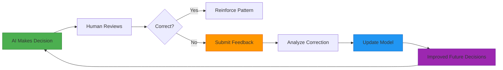

# Glossary

**Last Updated:** November 13, 2025  
**Version:** 1.0

---

## Overview

This glossary defines key terms, concepts, and components used throughout the AI Agentic Compliance Assistant system. Understanding these terms is essential for effectively using, maintaining, or extending the platform.

---

## Core Decision Types

### Autonomous Decision

**Definition:** A compliance task that the AI agent can handle independently without human review or approval.

**Criteria:**
- Risk score < 0.4 (LOW risk threshold)
- No special override conditions present
- High confidence score (typically > 0.75)
- Entity has good compliance history

**Example:**
```
Task: "What are the basic GDPR principles?"
Entity: Small startup, no violations
Result: AUTONOMOUS ✅
Reasoning: Low-risk general inquiry, no sensitive data involved
```

**Key Characteristics:**
- ✅ Agent proceeds immediately with recommended actions
- ✅ No human approval needed
- ✅ Full audit trail logged automatically
- ✅ Typically handles 60% of routine compliance queries

**Use Cases:**
- General compliance inquiries
- Standard policy questions
- Routine data retention queries
- Basic regulatory guidance
- Document templates for low-risk scenarios

---

### Review Required

**Definition:** A medium-risk compliance task that requires human review and approval before the agent can proceed with recommended actions.

**Criteria:**
- Risk score between 0.4 and 0.7 (MEDIUM risk)
- Moderate complexity or sensitivity
- May involve personal data or cross-border considerations
- Entity has mixed compliance history

**Example:**
```
Task: "Update privacy policy for GDPR compliance"
Entity: Mid-sized company, handles personal data
Result: REVIEW_REQUIRED ⚠️
Reasoning: Multi-jurisdictional, affects personal data, policy change
```

**Key Characteristics:**
- ⚠️ Agent generates recommendations but waits for approval
- ⚠️ Human compliance officer reviews before implementation
- ⚠️ Approval/rejection captured in feedback system
- ⚠️ Typically 30% of compliance tasks

**Review Process:**
1. Agent analyzes task and generates recommendations
2. System flags for human review with reasoning
3. Compliance officer reviews AI recommendations
4. Officer approves, modifies, or rejects
5. Decision and feedback logged for learning

---

### Escalation

**Definition:** A high-risk compliance task that requires immediate expert involvement and cannot be handled by the AI agent, even with review.

**Criteria:**
- Risk score > 0.7 (HIGH risk threshold)
- Involves critical incidents or major violations
- Affects large number of stakeholders (typically >1000)
- Regulated entity with previous violations
- Emergency situations (data breaches, regulatory investigations)

**Example:**
```
Task: "Data breach affecting 100,000 customers"
Entity: Financial institution, regulated, previous violations
Result: ESCALATE 🚨
Reasoning: Critical incident, massive impact, requires legal counsel
```

**Key Characteristics:**
- 🚨 Immediate notification to senior compliance team
- 🚨 Legal counsel involvement required
- 🚨 No AI recommendations provided (too high risk)
- 🚨 Typically <10% of tasks (system is conservative)

**Escalation Triggers:**
- Data breaches
- Regulatory investigations
- Major compliance violations
- Multi-million dollar penalty exposure
- Existential business risks
- Novel legal issues without precedent

---

## System Components

### Risk Engine

**Definition:** The core decision-making component that evaluates compliance tasks across six weighted factors to determine the appropriate level of autonomy.

**Architecture:**
```
Risk Engine
├── Jurisdiction Analyzer (15%)
├── Entity Risk Profiler (15%)
├── Task Complexity Evaluator (20%)
├── Data Sensitivity Classifier (20%)
├── Regulatory Oversight Assessor (20%)
└── Impact Severity Analyzer (10%)
    ↓
Weighted Risk Score (0-1)
    ↓
Decision: AUTONOMOUS | REVIEW | ESCALATE
```

**6 Risk Factors:**

1. **Jurisdiction Complexity (15%)** — How many regulatory frameworks apply?
2. **Entity Risk Profile (15%)** — What's the organization's compliance history?
3. **Task Complexity (20%)** — How difficult is this task to execute correctly?
4. **Data Sensitivity (20%)** — What types of data are involved?
5. **Regulatory Oversight (20%)** — Is the entity directly regulated?
6. **Impact Severity (10%)** — What's the potential cost of an error?

**Output:**
- Weighted risk score (0.0 to 1.0)
- Decision recommendation (AUTONOMOUS, REVIEW, ESCALATE)
- Confidence score (0.0 to 1.0)
- Factor-by-factor breakdown
- Natural language reasoning chain

**Example Output:**
```json
{
  "risk_score": 0.58,
  "decision": "REVIEW_REQUIRED",
  "confidence": 0.82,
  "factors": {
    "jurisdiction": 0.65,
    "entity": 0.45,
    "task_complexity": 0.70,
    "data_sensitivity": 0.60,
    "regulatory_oversight": 0.50,
    "impact": 0.55
  }
}
```

---

### Counterfactual Explanations

**Definition:** Alternative scenarios generated by the AI to show how the decision would change under different conditions, helping users understand the sensitivity and boundaries of risk assessments.

**Purpose:**
- **Transparency** — Show why a particular decision was made
- **Education** — Help users understand risk factors
- **Testing** — Explore decision boundaries
- **Debugging** — Identify potential edge cases

**Types of Counterfactuals:**

**1. Entity-Based:**
```
Original: "Startup with 50 employees → AUTONOMOUS"
Counterfactual: "What if employee count = 10,000?"
Result: "Would escalate to REVIEW_REQUIRED (regulatory oversight triggered)"
```

**2. Jurisdiction-Based:**
```
Original: "US_FEDERAL only → AUTONOMOUS"
Counterfactual: "What if jurisdiction = [US, EU, UK]?"
Result: "Would escalate to REVIEW_REQUIRED (multi-jurisdictional complexity)"
```

**3. Data-Based:**
```
Original: "No personal data → AUTONOMOUS"
Counterfactual: "What if affects_personal_data = true?"
Result: "Would escalate to REVIEW_REQUIRED (data sensitivity increase)"
```

**4. History-Based:**
```
Original: "Zero violations → AUTONOMOUS"
Counterfactual: "What if previous_violations = 2?"
Result: "Would escalate to ESCALATE (pattern of non-compliance)"
```

**Use Cases:**
- Training compliance staff on risk factors
- Explaining decisions to auditors
- Identifying systematic bias in the model
- Understanding why borderline cases went one way vs another
- Testing robustness of decisions

**Implementation:**
```python
# Generate counterfactual
counterfactual = generate_counterfactual(
    original_entity=entity,
    change={"employee_count": 10000}
)

# Output
{
  "original_decision": "AUTONOMOUS",
  "counterfactual_decision": "REVIEW_REQUIRED",
  "changed_factors": ["regulatory_oversight", "impact_severity"],
  "explanation": "Large entity size triggers regulatory considerations"
}
```

---

### Organizational Memory

**Definition:** The system's ability to maintain persistent memory of every entity's compliance history, risk profile, and interaction patterns over time.

**Also Known As:** Entity Memory System, Entity Context Manager

**Components:**

**1. Entity Profile**
- Basic metadata (name, type, industry, size)
- Jurisdictions and regulatory status
- Contact information and key personnel

**2. Compliance History**
- Every decision made for this entity
- Timestamp, task type, outcome
- Risk scores and confidence levels over time

**3. Violation Records**
- Previous compliance failures
- Severity and regulatory consequences
- Remediation actions taken
- Current status (resolved, pending, recurring)

**4. Risk Trend Analysis**
- Historical risk score progression
- Pattern detection (improving vs. declining)
- Anomaly identification

**5. Feedback and Corrections**
- Human reviewer corrections
- Override patterns
- Learning adjustments specific to this entity

**Example Entity Memory:**
```json
{
  "entity_id": "tech_corp_123",
  "entity_name": "TechCorp Inc",
  "first_seen": "2024-01-15T10:30:00Z",
  "total_interactions": 47,
  "compliance_history": {
    "autonomous": 35,
    "review_required": 10,
    "escalated": 2
  },
  "violations": [
    {
      "date": "2024-06-12",
      "type": "GDPR_DATA_BREACH",
      "severity": "MEDIUM",
      "status": "RESOLVED"
    }
  ],
  "risk_trend": {
    "current": 0.45,
    "30_days_ago": 0.62,
    "90_days_ago": 0.78,
    "trajectory": "IMPROVING"
  }
}
```

**Benefits:**
- ✅ More accurate risk assessments over time
- ✅ Personalized recommendations per entity
- ✅ Early warning for deteriorating compliance
- ✅ Recognition of entities with strong track records

---

### Human Feedback Loop

**Definition:** A continuous learning mechanism where human compliance experts review AI decisions, provide corrections, and enable the system to improve its accuracy over time.

**How It Works:**



**Feedback Types:**

**1. Decision Override**
```json
{
  "original_decision": "AUTONOMOUS",
  "correct_decision": "REVIEW_REQUIRED",
  "reason": "Underestimated cross-border data transfer risk",
  "severity": "MEDIUM"
}
```

**2. Factor Correction**
```json
{
  "factor": "jurisdiction_complexity",
  "original_score": 0.3,
  "corrected_score": 0.7,
  "reason": "Missed applicability of CCPA in addition to GDPR"
}
```

**3. Recommendation Adjustment**
```json
{
  "original_recommendation": "Standard GDPR consent form",
  "better_recommendation": "Enhanced consent with explicit opt-in for children's data",
  "reason": "Entity handles data of minors, requires special protection"
}
```

**Learning Outcomes:**
- **Threshold Tuning** — Adjust autonomy thresholds based on accuracy
- **Factor Weight Adjustment** — Reweight risk factors that are consistently miscalibrated
- **Entity-Specific Learning** — Remember entity quirks and exceptions
- **Pattern Recognition** — Identify systematic blind spots

**Metrics Tracked:**
- Override rate (% of decisions corrected by humans)
- Correction severity distribution
- Time to correction (how fast issues are caught)
- Learning velocity (how quickly accuracy improves)

---

### Proactive Suggestions

**Definition:** AI-generated recommendations that anticipate compliance needs before they become urgent, enabling preventive rather than reactive compliance management.

**Types of Proactive Suggestions:**

**1. Deadline Monitoring**
```
Trigger: Compliance deadline approaching
Suggestion: "Annual SOX audit due in 14 days. Schedule internal review meeting."
Priority: HIGH
Action: "Schedule meeting, prepare documentation"
```

**2. Regulatory Change Detection**
```
Trigger: New regulation published
Suggestion: "GDPR amendments effective March 2025. Review data processing agreements."
Priority: MEDIUM
Action: "Update policies, train staff"
```

**3. Risk Pattern Analysis**
```
Trigger: Multiple similar incidents detected
Suggestion: "3 data handling incidents in 30 days. Consider staff training program."
Priority: HIGH
Action: "Implement training, review procedures"
```

**4. Preventive Actions**
```
Trigger: Trend analysis shows increasing risk
Suggestion: "Entity risk score increased 25% in 90 days. Schedule compliance audit."
Priority: MEDIUM
Action: "Conduct internal audit, identify gaps"
```

**5. Best Practice Recommendations**
```
Trigger: Entity reaches maturity milestone
Suggestion: "50+ employees reached. Consider appointing dedicated compliance officer."
Priority: LOW
Action: "Evaluate organizational structure"
```

**Suggestion Generation Logic:**
```python
if upcoming_deadline_within_30_days():
    generate_deadline_suggestion(priority="HIGH")

if entity_risk_trend == "INCREASING":
    generate_preventive_audit_suggestion()

if similar_incidents_count >= 3:
    generate_training_suggestion(priority="HIGH")

if regulatory_change_detected():
    generate_policy_review_suggestion()
```

**Benefits:**
- 🎯 **Preventive Compliance** — Catch issues before they become problems
- 📅 **Deadline Management** — Never miss critical compliance dates
- 📚 **Continuous Improvement** — Identify systemic issues early
- 💡 **Knowledge Sharing** — Suggest best practices from similar entities

---

### Confidence Score

**Definition:** A numerical measure (0.0 to 1.0) indicating how certain the AI system is about its decision, based on factors like data quality, historical accuracy, and model uncertainty.

**Calculation Factors:**

**1. Historical Accuracy (40%)**
```python
# How often have similar decisions been correct in the past?
if similar_tasks_accuracy > 0.9:
    confidence_boost = 0.4
```

**2. Entity Data Completeness (25%)**
```python
# Do we have complete information about the entity?
completeness = filled_fields / total_fields
confidence_factor = completeness * 0.25
```

**3. Decision Margin (20%)**
```python
# How close to a threshold boundary is the decision?
if risk_score in [0.35, 0.45]:  # Near 0.4 threshold
    confidence_penalty = -0.15
```

**4. Consensus Among Factors (15%)**
```python
# Do all 6 factors agree on risk level?
if factor_variance < 0.1:  # All factors similar
    confidence_boost = 0.15
```

**Confidence Ranges:**

| Range | Interpretation | Typical Action |
|-------|----------------|----------------|
| **0.90 - 1.00** | Very High Confidence | Proceed with minimal oversight |
| **0.75 - 0.89** | High Confidence | Standard autonomous processing |
| **0.60 - 0.74** | Moderate Confidence | Consider additional review |
| **0.40 - 0.59** | Low Confidence | Recommend human review |
| **0.00 - 0.39** | Very Low Confidence | Require human decision |

**Example:**
```json
{
  "decision": "AUTONOMOUS",
  "risk_score": 0.32,
  "confidence": 0.87,
  "confidence_breakdown": {
    "historical_accuracy": 0.92,
    "data_completeness": 0.85,
    "decision_margin": 0.88,
    "factor_consensus": 0.82
  },
  "interpretation": "HIGH — Proceed with standard autonomous processing"
}
```

**Use Cases:**
- Flagging uncertain decisions for human review
- Prioritizing feedback collection for low-confidence cases
- Measuring system improvement over time
- Building trust through transparency

---

### Audit Trail

**Definition:** A comprehensive, immutable log of every compliance decision made by the system, including complete reasoning chains, factor scores, timestamps, and outcomes.

**Purpose:**
- **Regulatory Compliance** — Demonstrate due diligence to auditors
- **Accountability** — Track who made what decisions and why
- **Learning** — Analyze historical decisions for improvement
- **Debugging** — Investigate when decisions were incorrect
- **Reporting** — Generate compliance reports for stakeholders

**Data Captured:**

**Core Decision Data:**
```json
{
  "audit_id": "aud_20250113_001",
  "timestamp": "2025-01-13T14:32:15Z",
  "decision": "REVIEW_REQUIRED",
  "risk_level": "MEDIUM",
  "risk_score": 0.58,
  "confidence": 0.82
}
```

**Entity Context:**
```json
{
  "entity_id": "tech_corp_123",
  "entity_name": "TechCorp Inc",
  "entity_type": "PRIVATE_COMPANY",
  "industry": "TECHNOLOGY",
  "jurisdictions": ["US_FEDERAL", "EU"]
}
```

**Task Details:**
```json
{
  "task_description": "Update privacy policy for GDPR compliance",
  "category": "POLICY_REVIEW",
  "affects_personal_data": true,
  "involves_cross_border": true,
  "stakeholder_count": 5000
}
```

**Risk Assessment:**
```json
{
  "factor_scores": {
    "jurisdiction": 0.65,
    "entity_risk": 0.45,
    "task_complexity": 0.70,
    "data_sensitivity": 0.60,
    "regulatory_oversight": 0.50,
    "impact": 0.55
  },
  "reasoning": [
    "Multi-jurisdictional (US + EU) increases complexity",
    "Entity has clean compliance record (positive factor)",
    "Policy review task requires legal expertise",
    "Personal data involved requires GDPR compliance",
    "5000+ stakeholders means significant impact potential"
  ]
}
```

**Recommendations:**
```json
{
  "recommendations": [
    "Engage legal counsel for GDPR review",
    "Ensure consent mechanisms meet Article 7 requirements",
    "Document legal basis for each processing activity",
    "Schedule Data Protection Impact Assessment (DPIA)"
  ]
}
```

**Metadata:**
```json
{
  "system_version": "1.0.2",
  "model_version": "gpt-4o-mini",
  "processing_time_ms": 245,
  "api_call_count": 2,
  "human_reviewer": null,
  "outcome": "PENDING"
}
```

**Query Capabilities:**
- Filter by date range, entity, risk level, decision type
- Search by keywords in reasoning or task description
- Export to JSON, CSV, or PDF
- Aggregate statistics (autonomy rate, average risk score)
- Trend analysis over time

**Retention Policy:**
- **Minimum:** 7 years (regulatory compliance)
- **Recommended:** Indefinite (continuous learning)
- **Encryption:** At rest for sensitive data
- **Access Control:** Role-based permissions

---

### Entity History

**Definition:** A chronological record of all interactions, decisions, and outcomes for a specific organization or entity, used to build context and improve decision accuracy over time.

**Data Structure:**

**Entity Profile:**
```json
{
  "entity_id": "tech_corp_123",
  "entity_name": "TechCorp Inc",
  "entity_type": "PRIVATE_COMPANY",
  "industry": "TECHNOLOGY",
  "employee_count": 500,
  "annual_revenue": "$50M",
  "jurisdictions": ["US_FEDERAL", "US_CALIFORNIA", "EU"],
  "is_regulated": false,
  "first_interaction": "2024-01-15T10:30:00Z",
  "last_interaction": "2025-01-13T14:32:15Z"
}
```

**Compliance Timeline:**
```json
{
  "total_interactions": 47,
  "decision_breakdown": {
    "AUTONOMOUS": 32,
    "REVIEW_REQUIRED": 13,
    "ESCALATE": 2
  },
  "autonomy_rate": 0.68,
  "timeline": [
    {
      "date": "2024-01-15",
      "task": "GDPR compliance inquiry",
      "decision": "AUTONOMOUS",
      "risk_score": 0.28
    },
    {
      "date": "2024-06-12",
      "task": "Data breach incident",
      "decision": "ESCALATE",
      "risk_score": 0.89
    }
  ]
}
```

**Violation History:**
```json
{
  "violations": [
    {
      "violation_id": "vio_20240612_001",
      "date": "2024-06-12",
      "type": "GDPR_DATA_BREACH",
      "severity": "MEDIUM",
      "description": "Unauthorized access to 50 customer records",
      "regulatory_action": "WARNING",
      "fine_amount": "$5,000",
      "remediation": "Implemented MFA, conducted staff training",
      "status": "RESOLVED",
      "resolved_date": "2024-07-30"
    }
  ],
  "total_violations": 1,
  "total_fines": "$5,000"
}
```

**Risk Trend:**
```json
{
  "current_risk_score": 0.42,
  "risk_history": [
    {"date": "2024-01", "score": 0.35},
    {"date": "2024-06", "score": 0.82},
    {"date": "2024-07", "score": 0.68},
    {"date": "2024-12", "score": 0.45},
    {"date": "2025-01", "score": 0.42}
  ],
  "trajectory": "IMPROVING",
  "volatility": "LOW"
}
```

**Feedback Records:**
```json
{
  "corrections_received": 3,
  "last_correction": "2024-09-15",
  "correction_types": {
    "decision_override": 2,
    "factor_adjustment": 1
  }
}
```

**Use Cases:**
- **Risk Assessment** — Higher risk for entities with violation history
- **Personalization** — Tailor recommendations to entity's industry and size
- **Trend Detection** — Identify improving or declining compliance patterns
- **Benchmarking** — Compare entity to similar organizations
- **Predictive Analysis** — Forecast future compliance risks

---

## Related Concepts

### Weighted Risk Scoring
- Each of the 6 risk factors has a specific weight
- Total risk score = Σ(factor_score × factor_weight)
- Thresholds determine decision type

### Decision Thresholds
- **< 0.4** → AUTONOMOUS
- **0.4 - 0.7** → REVIEW_REQUIRED
- **> 0.7** → ESCALATE

### Regulatory Frameworks
- **GDPR** — EU General Data Protection Regulation
- **HIPAA** — US Health Insurance Portability and Accountability Act
- **SOX** — Sarbanes-Oxley Act (US financial compliance)
- **CCPA** — California Consumer Privacy Act
- **PIPEDA** — Canadian Personal Information Protection and Electronic Documents Act

---

## Abbreviations

- **AI** — Artificial Intelligence
- **API** — Application Programming Interface
- **CCPA** — California Consumer Privacy Act
- **DPIA** — Data Protection Impact Assessment
- **GDPR** — General Data Protection Regulation
- **HIPAA** — Health Insurance Portability and Accountability Act
- **LLM** — Large Language Model
- **PII** — Personally Identifiable Information
- **PIPEDA** — Personal Information Protection and Electronic Documents Act
- **SOX** — Sarbanes-Oxley Act
- **UI** — User Interface

---

*Last updated: November 13, 2025*  
*For technical architecture details, see [ARCHITECTURE.md](../production_engine/ARCHITECTURE.md)*
