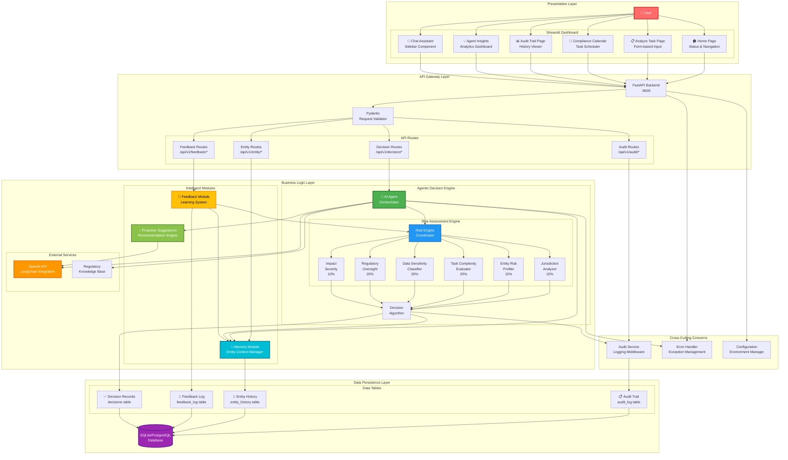
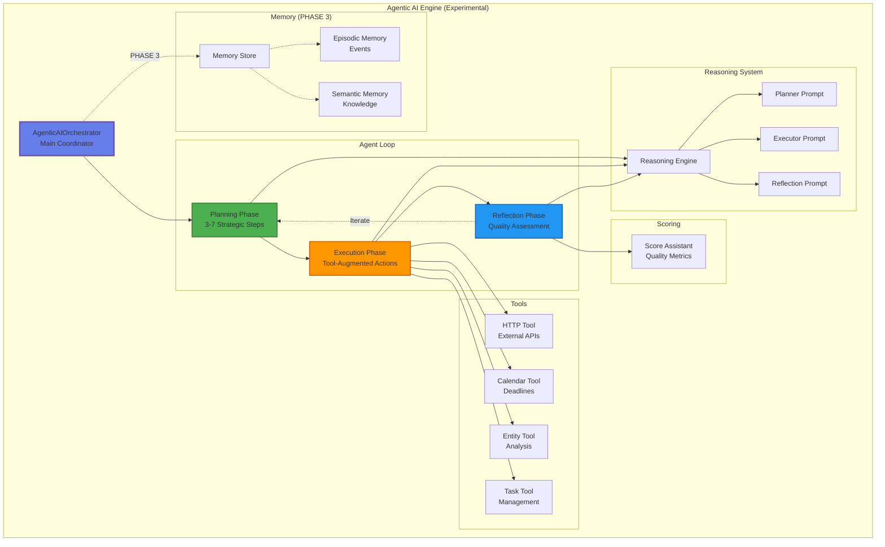

# System Architecture

**Version:** 1.0  
**Last Updated:** November 13, 2025  
**Status:** Production Ready (MVP)

---

## Overview

The AI Agentic Compliance Assistant is built on a **multi-layered architecture** that separates concerns across presentation, business logic, and data persistence layers. The system follows **microservices principles** with a RESTful API backend, a user-friendly Streamlit frontend, and an intelligent agentic decision engine powered by OpenAI GPT.

The architecture emphasizes:
- 🎯 **Modularity** — Independent, testable components
- 🔄 **Scalability** — Async-first design for concurrent processing
- 📊 **Observability** — Complete audit trails and decision logging
- 🧠 **Intelligence** — AI-powered reasoning with human oversight
- 🔒 **Reliability** — Comprehensive error handling and validation

---

## System Architecture Diagram



---

## Component Descriptions

### Presentation Layer

#### 👤 User
The end user interacting with the system, typically:
- **Compliance Officers** — Reviewing automated decisions
- **Compliance Analysts** — Analyzing entity risk profiles
- **Business Managers** — Viewing compliance calendars and insights
- **Auditors** — Accessing audit trails and decision history

#### Streamlit Dashboard

A **modern, user-friendly web interface** built with Streamlit that eliminates the need for users to understand JSON or API calls.

**Components:**

**🏠 Home Page (`Home.py`)**
- Landing page with navigation
- Real-time API health status
- Quick statistics dashboard
- Large action buttons for main features

**📋 Analyze Task Page (`1_Analyze_Task.py`)**
- Form-based task analysis interface
- Dropdown selectors for all fields (no JSON required)
- Instant AI-powered risk assessment
- Visual results with color-coded risk indicators
- Export functionality (JSON, CSV, text)

**📅 Compliance Calendar (`2_Compliance_Calendar.py`)**
- Auto-generates compliance task schedules
- Displays all tasks with frequencies and deadlines
- Filterable by risk level, decision type, frequency
- Exportable to Excel/CSV

**📊 Audit Trail Page (`3_Audit_Trail.py`)**
- Complete decision history viewer
- Advanced filtering by date, risk, decision type
- Full reasoning chain display for each decision
- Export for regulatory compliance reports

**💡 Agent Insights (`4_Agent_Insights.py`)**
- Analytics and metrics dashboard
- Risk distribution charts
- Decision accuracy statistics
- Entity behavior patterns
- System performance metrics

**💬 Chat Assistant (Sidebar Component)**
- Conversational AI interface
- Natural language compliance queries
- Context-aware responses
- Available across all dashboard pages

---

### API Gateway Layer

#### FastAPI Backend
The **core API server** running on port 8000, providing:
- Async request handling for high concurrency
- Automatic OpenAPI documentation (`/docs`)
- Request/response validation with Pydantic
- CORS support for cross-origin requests
- Comprehensive error handling

**API Routes:**

**Decision Routes (`/api/v1/decision/*`)**
- `POST /analyze` — Analyze single compliance task
- `POST /batch-analyze` — Process multiple tasks
- `POST /quick-check` — Fast risk assessment
- `GET /risk-levels` — Risk level information

**Entity Routes (`/api/v1/entity/*`)**
- `POST /analyze` — Analyze entity and generate calendar
- `GET /history/{entity_id}` — Entity compliance history
- `GET /risk-profile/{entity_id}` — Current risk profile

**Audit Routes (`/api/v1/audit/*`)**
- `GET /recent` — Recent audit entries
- `GET /entries` — Filtered audit logs
- `GET /export/json` — JSON export
- `GET /statistics` — Audit statistics

**Feedback Routes (`/api/v1/feedback/*`)**
- `POST /submit` — Submit decision feedback
- `GET /corrections` — View all corrections
- `GET /patterns` — Identify learning patterns

#### Pydantic Request Validator
Ensures all incoming requests are:
- **Type-safe** — Correct data types enforced
- **Complete** — Required fields validated
- **Sanitized** — Prevents injection attacks
- **Well-formed** — JSON schema compliance

---

### Business Logic Layer

#### 🤖 AI Agent Orchestrator
The **central intelligence** coordinating all AI-powered decisions:

**Responsibilities:**
- Receives validated requests from API
- Orchestrates multi-factor risk assessment
- Queries entity memory for historical context
- Calls OpenAI API for natural language reasoning
- Coordinates proactive suggestion generation
- Triggers audit trail logging
- Returns structured decisions with reasoning

**Key Features:**
- LangChain integration for prompt management
- Conversation memory for context retention
- Error recovery and retry logic
- Confidence score calibration

---

#### Risk Assessment Engine

The **6-factor risk model** that evaluates compliance tasks:

**Risk Engine Coordinator**
- Orchestrates parallel execution of 6 analyzers
- Computes weighted risk score (0-1 scale)
- Applies override rules for edge cases
- Generates confidence metrics

**Factor Analyzers:**

**1. Jurisdiction Analyzer (15%)**
- Identifies applicable regulations (GDPR, HIPAA, SOX, etc.)
- Detects multi-jurisdictional complexity
- Flags cross-border data transfer scenarios
- Evaluates regulatory conflict risks

**2. Entity Risk Profiler (15%)**
- Analyzes entity type (startup, public company, financial institution)
- Reviews compliance history from memory module
- Assesses organizational maturity
- Factors in previous violations

**3. Task Complexity Evaluator (20%)**
- Categorizes task type (inquiry, policy review, filing, incident)
- Evaluates technical complexity
- Considers deadline pressure
- Assesses stakeholder impact

**4. Data Sensitivity Classifier (20%)**
- Identifies PII, financial data, health records
- Calculates combined risk for multiple data types
- Applies appropriate protection standards
- Flags special categories (children's data, biometrics)

**5. Regulatory Oversight (20%)**
- Determines if entity is directly regulated
- Identifies reporting obligations
- Evaluates penalty exposure
- Assesses enforcement history in jurisdiction

**6. Impact Severity (10%)**
- Analyzes potential error consequences
- Considers financial, reputational, legal impacts
- Factors in affected stakeholder count
- Evaluates business continuity risks

**Decision Algorithm**
- Aggregates weighted scores
- Applies decision thresholds:
  - **< 0.4 → AUTONOMOUS** (Low Risk)
  - **0.4-0.7 → REVIEW_REQUIRED** (Medium Risk)
  - **> 0.7 → ESCALATE** (High Risk)
- Generates confidence score
- Produces reasoning chain

---

#### 🧠 Memory Module (Entity Context Manager)

Maintains **persistent memory** of all entities and their interactions:

**Functions:**
- **Historical Tracking** — Stores all past decisions for each entity
- **Risk Profile Evolution** — Updates entity risk profiles over time
- **Violation Recording** — Maintains compliance failure history
- **Context Enrichment** — Adds historical context to new decisions
- **Pattern Detection** — Identifies recurring compliance issues

**Data Stored:**
- Entity metadata (name, type, industry, size)
- Compliance history (all decisions)
- Violation records (dates, types, severity)
- Feedback corrections (learning data)
- Risk score trends

**Example Use Case:**
```python
# First interaction: No history
entity_risk = 0.3  # Low risk

# After 2 violations detected
entity_risk = 0.6  # Risk elevated due to history

# After successful remediation
entity_risk = 0.4  # Risk reduced but monitored
```

---

#### 🔄 Feedback Module (Learning System)

Implements **continuous improvement** through human feedback:

**Capabilities:**
- **Explicit Feedback Collection** — Reviewers can mark decisions as incorrect
- **Override Tracking** — Logs when humans change agent decisions
- **Pattern Recognition** — Identifies systematic assessment gaps
- **Threshold Adjustment** — Tunes risk thresholds based on accuracy
- **Confidence Calibration** — Improves confidence score reliability

**Feedback Types:**
1. **Decision Override** — "This should have been escalated"
2. **Factor Correction** — "Jurisdiction risk was underestimated"
3. **Recommendation Feedback** — "Suggested action was not appropriate"
4. **Outcome Reporting** — "Decision led to compliance issue"

**Learning Process:**
```
Human Feedback → Pattern Analysis → Model Adjustment → Improved Decisions
```

---

#### 💡 Proactive Suggestions Module (Recommendation Engine)

Generates **predictive recommendations** before issues arise:

**Features:**
- **Deadline Monitoring** — Tracks upcoming compliance obligations
- **Regulatory Change Detection** — Monitors for new regulations
- **Risk Pattern Analysis** — Identifies emerging compliance risks
- **Preventive Recommendations** — Suggests actions before incidents

**Suggestion Types:**

**UPCOMING_DEADLINE**
```json
{
  "priority": "HIGH",
  "message": "Annual SOX audit due in 14 days",
  "action": "Schedule internal review"
}
```

**REGULATORY_CHANGE**
```json
{
  "priority": "MEDIUM",
  "message": "New GDPR amendments effective next month",
  "action": "Review data processing policies"
}
```

**RISK_PATTERN**
```json
{
  "priority": "HIGH",
  "message": "3 similar data handling incidents in 30 days",
  "action": "Consider staff training program"
}
```

---

### External Services

#### OpenAI API (LangChain Integration)
- **Natural Language Processing** — Understands compliance queries
- **Reasoning Generation** — Produces human-readable explanations
- **Context Management** — Maintains conversation history
- **Prompt Optimization** — Uses engineered prompts for accuracy

#### Regulatory Knowledge Base
- **Regulation Database** — GDPR, HIPAA, SOX, CCPA, PIPEDA, etc.
- **Jurisdiction Mappings** — Which laws apply where
- **Compliance Requirements** — Specific obligations per regulation
- **Case Law References** — Relevant legal precedents

---

### Data Persistence Layer

#### Database (SQLite/PostgreSQL)

**Development:** SQLite (file-based, zero config)  
**Production:** PostgreSQL (scalable, concurrent, ACID-compliant)

**Data Tables:**

**📋 Audit Trail (`audit_log`)**
```sql
- id: UUID (primary key)
- timestamp: DateTime
- entity_id: String
- task_description: Text
- decision: Enum (AUTONOMOUS, REVIEW_REQUIRED, ESCALATE)
- risk_level: Enum (LOW, MEDIUM, HIGH)
- risk_score: Float
- confidence: Float
- reasoning: JSON
- factor_scores: JSON
- metadata: JSON
```

**👥 Entity History (`entity_history`)**
```sql
- id: UUID (primary key)
- entity_id: String (indexed)
- entity_name: String
- entity_type: String
- industry: String
- first_seen: DateTime
- last_interaction: DateTime
- total_decisions: Integer
- autonomous_count: Integer
- review_count: Integer
- escalate_count: Integer
- violations: Integer
- risk_trend: JSON
```

**💭 Feedback Log (`feedback_log`)**
```sql
- id: UUID (primary key)
- decision_id: UUID (foreign key)
- timestamp: DateTime
- reviewer_id: String
- original_decision: String
- correct_decision: String
- severity: Enum (LOW, MEDIUM, HIGH, CRITICAL)
- notes: Text
- factor_corrections: JSON
```

**✅ Decision Records (`decisions`)**
```sql
- id: UUID (primary key)
- entity_id: String
- timestamp: DateTime
- decision: String
- risk_score: Float
- reasoning: JSON
- outcome: String (nullable, updated later)
```

---

### Cross-Cutting Concerns

#### Audit Service (Logging Middleware)
- Intercepts all decision operations
- Logs complete reasoning chains
- Stores factor-by-factor scores
- Timestamps all operations
- Enables compliance reporting

#### Error Handler (Exception Management)
- Catches and logs all exceptions
- Provides user-friendly error messages
- Prevents sensitive data leakage
- Triggers alerts for critical errors
- Maintains system stability

#### Configuration (Environment Manager)
- Loads environment variables
- Validates required settings
- Provides defaults for optional configs
- Manages API keys securely
- Environment-specific configurations

---

## Data Flow

### 1. Typical Decision Request Flow

```
User Input (Dashboard) 
  → API Request (FastAPI)
  → Request Validation (Pydantic)
  → Orchestrator Receives Task
  → Memory Lookup (Entity History)
  → Risk Assessment (6 Factors)
  → AI Reasoning (OpenAI API)
  → Decision Algorithm
  → Proactive Suggestions
  → Audit Logging
  → Response to User
```

### 2. Memory Update Flow

```
Decision Made
  → Entity ID Extracted
  → Memory Module Checks Existence
  → If New: Create Entity Record
  → If Existing: Update History
  → Store Decision Metadata
  → Update Risk Trend
  → Persist to Database
```

### 3. Feedback Processing Flow

```
Human Reviewer Submits Feedback
  → Feedback Module Receives Data
  → Links to Original Decision
  → Analyzes Pattern
  → Updates Entity Memory
  → Adjusts Risk Model (if needed)
  → Logs for Future Reference
  → Triggers Retraining (if threshold reached)
```

---

## Technology Stack

### Backend
- **Python 3.11+** — Modern type hints, async support
- **FastAPI 0.104+** — Async REST framework
- **LangChain 0.3+** — LLM orchestration
- **SQLAlchemy 2.0+** — ORM with async support
- **Pydantic 2.7+** — Data validation
- **Uvicorn 0.24+** — ASGI server

### Frontend
- **Streamlit** — Dashboard framework
- **Pandas** — Data manipulation
- **Plotly** — Visualizations

### AI/ML
- **OpenAI GPT-4o-mini** — Primary reasoning engine
- **OpenAI API** — LLM provider
- **LangChain** — Prompt engineering

### Database
- **SQLite** — Development database
- **PostgreSQL** — Production database (recommended)

---

## Deployment Architecture

### Development
```
Local Machine
├── Python Virtual Environment
├── SQLite Database (file-based)
├── Uvicorn Server (FastAPI)
└── Streamlit Dashboard
```

### Production (Recommended)
```
Cloud Infrastructure (AWS/GCP/Azure)
├── Load Balancer
├── FastAPI Containers (Kubernetes)
│   ├── Pod 1: API Server
│   ├── Pod 2: API Server
│   └── Pod N: API Server (auto-scaling)
├── Streamlit Containers
├── PostgreSQL Database (managed service)
├── Redis Cache (session/query caching)
└── Logging/Monitoring (CloudWatch/Stackdriver)
```

---

## Security Considerations

### Current Implementation
- ✅ Request validation with Pydantic
- ✅ Environment-based configuration
- ✅ SQL injection prevention via ORM
- ✅ Error message sanitization

### Production Requirements
- ⚠️ API authentication (JWT tokens)
- ⚠️ Rate limiting per client
- ⚠️ HTTPS/TLS encryption
- ⚠️ API key rotation
- ⚠️ Audit log encryption
- ⚠️ Role-based access control (RBAC)

---

## Scalability & Performance

### Current Capacity
- **Concurrent Requests:** ~100/second (single instance)
- **Response Time:** <500ms average
- **Database:** SQLite (suitable for <10K records)

### Production Scaling
- **Horizontal Scaling:** Deploy multiple API instances behind load balancer
- **Database:** Migrate to PostgreSQL with connection pooling
- **Caching:** Redis for frequent queries (risk levels, entity profiles)
- **Async Processing:** Background jobs for batch analysis
- **CDN:** Static asset delivery for dashboard

---

## Monitoring & Observability

### Implemented
- ✅ Health check endpoint (`/health`)
- ✅ Structured logging
- ✅ Complete audit trail

### Recommended for Production
- 📊 **Metrics:** Prometheus + Grafana
- 🔍 **Tracing:** OpenTelemetry
- 🚨 **Alerting:** PagerDuty/Opsgenie
- 📝 **Log Aggregation:** ELK Stack or Datadog
- 📈 **APM:** New Relic or Datadog APM

---

## 🧪 Experimental: Agentic AI Engine

### Overview

The **Agentic AI Engine** is an experimental next-generation reasoning system that implements advanced plan-execute-reflect cycles for deep compliance analysis. This system operates independently from the existing decision engine and provides transparent, step-by-step reasoning.

**Status:** PHASE 2 Complete (Implementation + Integration), PHASE 3 Pending (Memory + Scoring)

### Architecture



### Components

#### 1. Orchestrator (`orchestrator.py`)
**Purpose:** Coordinates the entire agentic workflow

**Key Methods:**
- `plan()` - Generates strategic execution plan
- `execute_step()` - Runs individual steps with tools
- `reflect()` - Evaluates execution quality
- `run()` - Orchestrates complete workflow

#### 2. Agent Loop (`agent_loop.py`)
**Purpose:** Manages iterative execution cycles

**Key Methods:**
- `generate_plan()` - Creates step-by-step plan
- `run_steps()` - Executes plan sequentially
- `evaluate_reflection()` - Assesses quality
- `update_memory()` - Stores learnings

#### 3. Reasoning Engine (`reasoning/reasoning_engine.py`)
**Purpose:** Provides LLM-powered reasoning capabilities

**Prompts:**
- `planner_prompt.txt` - Strategic planning guidance
- `executor_prompt.txt` - Action execution instructions
- `reflection_prompt.txt` - Quality evaluation criteria

#### 4. Tools (`tools/`)
**Purpose:** Enable agent to interact with external systems

**Available Tools:**
- `http_tool.py` - HTTP requests for external APIs
- `calendar_tool.py` - Deadline and calendar management
- `entity_tool.py` - Entity analysis and retrieval
- `task_tool.py` - Task management operations

#### 5. Scoring (`scoring/score_assistant.py`)
**Purpose:** Evaluates decision and execution quality

**Metrics:**
- Quality score (0.0-1.0)
- Correctness validation
- Completeness assessment
- Confidence levels

#### 6. Memory System (`memory/` - PHASE 3)
**Purpose:** Persistent learning and pattern recognition

**Components:**
- `memory_store.py` - Central storage interface
- `episodic_memory.py` - Event-based memories
- `semantic_memory.py` - Knowledge abstractions

### API Integration

#### Endpoint: `/api/v1/agentic/analyze`

**Request:**
```json
{
  "entity": {
    "entity_name": "TechCorp",
    "locations": ["US", "EU"],
    "industry": "TECHNOLOGY"
  },
  "task": {
    "task_description": "Implement GDPR compliance",
    "task_category": "DATA_PROTECTION",
    "priority": "HIGH"
  },
  "max_iterations": 10
}
```

**Response:**
```json
{
  "status": "completed",
  "plan": [...],
  "step_outputs": [...],
  "reflections": [...],
  "final_recommendation": "...",
  "confidence_score": 0.89
}
```

### Dashboard Integration

**Page:** `dashboard/pages/5_Agentic_Analysis.py`

**Features:**
- Form-based entity and task input
- Tabbed results display (Plan, Steps, Reflections, Recommendation, Memory)
- Download full analysis as JSON
- Real-time progress indicators

### Development Phases

#### ✅ PHASE 1: Structure (Complete)
- [x] Module structure created
- [x] Class scaffolds implemented
- [x] API endpoints defined
- [x] Dashboard page created
- [x] Documentation written

#### ✅ PHASE 2: Logic Implementation + Integration (Complete)
- [x] Implement planning logic with LLM
- [x] Implement tools (HTTPTool, CalendarTool, EntityTool, TaskTool)
- [x] Implement execution loop
- [x] Add reflection evaluation
- [x] Add error handling and retry logic
- [x] API integration with transformation layer
- [ ] Integrate scoring system (PHASE 3 - ScoreAssistant pending)

#### 📋 PHASE 3: Memory & Learning (Planned)
- [ ] Implement memory store backend
- [ ] Add episodic memory recording
- [ ] Build semantic knowledge base
- [ ] Enable cross-session learning
- [ ] Implement pattern recognition

### Comparison: Existing vs. Agentic Engine

| Aspect | Existing Decision Engine | Agentic AI Engine |
|--------|-------------------------|-------------------|
| **Approach** | Rule-based risk scoring | Plan-execute-reflect reasoning |
| **Transparency** | Risk factors + final decision | Step-by-step reasoning chain |
| **Adaptability** | Fixed 6-factor model | Tool-augmented, iterative |
| **Memory** | Entity history only | Episodic + semantic memory |
| **Tools** | None | HTTP, calendar, entity, task tools |
| **Reflection** | None | Quality assessment per step |
| **Use Case** | Fast compliance decisions | Deep analysis, complex scenarios |

### Configuration

**Environment Variables:**
```bash
# Required for Agentic Engine
OPENAI_API_KEY=sk-proj-your-key-here
OPENAI_MODEL=gpt-4o-mini
BACKEND_URL=http://localhost:8000
```

### Directory Structure

```
src/agentic_engine/
├── __init__.py
├── orchestrator.py              # Main coordinator
├── agent_loop.py                # Execution loop
├── reasoning/
│   ├── reasoning_engine.py      # LLM reasoning
│   └── prompts/
│       ├── planner_prompt.txt
│       ├── executor_prompt.txt
│       └── reflection_prompt.txt
├── scoring/
│   └── score_assistant.py       # Quality evaluation
├── tools/
│   ├── __init__.py
│   ├── http_tool.py
│   ├── calendar_tool.py
│   ├── entity_tool.py
│   └── task_tool.py
└── memory/
    ├── __init__.py
    ├── memory_store.py
    ├── episodic_memory.py
    └── semantic_memory.py
```

### Testing Strategy (PHASE 2)

#### Unit Tests
- [ ] Orchestrator methods
- [ ] Agent loop functions
- [ ] Tool integrations
- [ ] Scoring calculations

#### Integration Tests
- [ ] End-to-end workflow
- [ ] API endpoint responses
- [ ] Dashboard functionality
- [ ] Memory persistence

#### Performance Tests
- [ ] Response time benchmarks
- [ ] Token usage optimization
- [ ] Concurrent request handling

---

## Future Enhancements

### Phase 3: Production Hardening
- [ ] PostgreSQL migration with connection pooling
- [ ] Redis caching layer
- [ ] JWT authentication & authorization
- [ ] Rate limiting middleware
- [ ] Docker containerization
- [ ] Kubernetes manifests

### Phase 4: Advanced Features
- [ ] Multi-language support
- [ ] Document upload & parsing (PDF/DOCX)
- [ ] Fine-tuned compliance model
- [ ] Real-time collaboration features
- [ ] Slack/Teams integration
- [ ] **Complete Agentic Engine PHASE 2 & 3**

### Phase 5: Enterprise Scale
- [ ] Multi-tenant architecture
- [ ] SSO integration (SAML/OAuth)
- [ ] Custom risk model per organization
- [ ] Advanced analytics dashboard
- [ ] Automated report generation
- [ ] **Agentic Engine production deployment**

---

## References

- **FastAPI Documentation:** https://fastapi.tiangolo.com/
- **LangChain Documentation:** https://python.langchain.com/
- **Streamlit Documentation:** https://docs.streamlit.io/
- **SQLAlchemy Documentation:** https://docs.sqlalchemy.org/

---

*Last updated: November 13, 2025*  
*Architecture Version: 1.0*  
*Status: Production Ready (MVP)*
