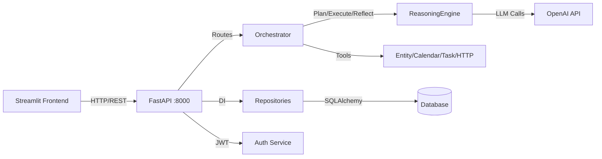

# Architecture v2 - Agentic Compliance Assistant

**Version:** 2.0  
**Last Updated:** December 2025  
**Status:** Demo/portfolio build (needs hardening for production)

---

## Overview

The Agentic Compliance Assistant follows a **unified schema architecture** with a single LLM gateway, comprehensive audit logging, and strict separation of concerns. All components follow Architecture v2 principles.

## Core Principles

1. **Unified Schemas** - Single source of truth for all data structures
2. **Single LLM Gateway** - All OpenAI calls through `backend/utils/llm_client.py`
3. **Complete Audit Trail** - Every decision logged to database
4. **Demo Defaults** - Ships with demo login and mock-mode LLM; replace secrets/LLM for prod
5. **Error Handling** - Standardized, no swallowed exceptions
6. **Schema Compliance** - Frontend and backend use identical schemas

---

## Quick Reference (Interview Cheat Sheet)

### System Flow



**Flow**: User → Frontend → API Routes → Orchestrator → AgentLoop → ReasoningEngine → OpenAI

### Key File Locations

| Component | Path |
|-----------|------|
| **API Routes** | `backend/api/*_routes.py` |
| **Orchestrator** | `backend/agentic_engine/orchestrator.py` |
| **Agent Loop** | `backend/agentic_engine/agent_loop.py` |
| **Reasoning Engine** | `backend/agentic_engine/reasoning/reasoning_engine.py` |
| **Test Suite** | `backend/agentic_engine/testing/test_suite_engine.py` |
| **Repositories** | `backend/repositories/base_repository.py` |
| **LLM Gateway** | `backend/utils/llm_client.py` |
| **Decision Engine** | `backend/agent/decision_engine.py` |

### Code Snippets

#### 1. Repository Pattern (Generic Base)

```python
# backend/repositories/base_repository.py
class BaseRepository(ABC, Generic[T]):
    def __init__(self, db: Session):
        self.db = db
    
    @abstractmethod
    def create(self, entity: T) -> T: ...
    
    @abstractmethod
    def get_by_id(self, entity_id: int) -> Optional[T]: ...

# Usage: AuditTrailRepository(BaseRepository[AuditTrail])
```
**Why**: Type-safe, testable data access layer with consistent CRUD operations.

#### 2. Dependency Injection (FastAPI Depends)

```python
# backend/api/audit_routes.py
@router.get("/entries")
def get_audit_entries(
    limit: int = Query(10),
    entity_name: Optional[str] = None,
    db: Session = Depends(get_db)  # ← DI here
):
    repository = AuditTrailRepository(db)
    return repository.get_all(limit=limit, entity_name=entity_name)
```
**Why**: Automatic session management, testable endpoints, clean separation of concerns.

#### 3. Reflection Method (Agentic Loop)

```python
# backend/agentic_engine/reasoning/reasoning_engine.py
def reflect(self, step: Dict, output: Dict) -> Dict:
    """Critically evaluate step execution quality"""
    prompt = f"Evaluate correctness, completeness, hallucination risk..."
    llm_response = self._llm_call(prompt)
    return {
        "correctness_score": 0.0-1.0,
        "completeness_score": 0.0-1.0,
        "overall_quality": 0.0-1.0,
        "issues": [...],
        "requires_retry": bool
    }
```
**Why**: Self-correcting agentic loop - AI critiques its own work before proceeding.

### Architectural Choices (One-Liners)

| Choice | Rationale |
|--------|-----------|
| **Repository Pattern** | Decouples business logic from SQLAlchemy, enables easy testing/mocking |
| **FastAPI Depends** | Automatic dependency injection, request-scoped DB sessions, clean API |
| **Single LLM Gateway** | Centralized OpenAI calls, consistent error handling, mock mode support |
| **Agentic Loop (Plan→Execute→Reflect)** | Multi-step reasoning with self-correction, handles complex tasks |
| **Unified Schemas** | Frontend/backend share same data structures, prevents drift |
| **JWT Auth** | Stateless authentication, scalable, works with FastAPI middleware |
| **Generic Repositories** | Type-safe CRUD operations, reduces boilerplate, consistent patterns |
| **Memory System** | Episodic memory for entity context, improves consistency over time |
| **Test Suite Engine** | Automated scenario testing, validates decision accuracy, CI/CD ready |

### Current State / Metrics

- Small test suite (`tests/` + limited frontend tests); coverage not reported
- 6-factor risk model with 3-tier decisions (AUTONOMOUS/REVIEW/ESCALATE)
- Audit trail implemented; persistence depends on configured `DATABASE_URL`
- Mock-mode available when `OPENAI_API_KEY` is absent; production should supply a real key

**Tech Stack**: Python 3.11+, FastAPI, Streamlit, SQLAlchemy, OpenAI GPT-4o-mini, SQLite/PostgreSQL

---

## System Architecture

```mermaid
graph TB
    subgraph "Frontend Layer"
        STREAMLIT[Streamlit Dashboard]
        PAGES[Pages: Home, Analyze Task, Audit Trail, Agentic Analysis, Test Suite]
        COMPONENTS[Components: Forms, Charts, Auth, API Client]
    end
    
    subgraph "API Gateway Layer"
        FASTAPI[FastAPI Backend :8000]
        
        subgraph "API Routes"
            DECISION[/api/v1/decision/*]
            ENTITY[/api/v1/entity/*]
            AUDIT[/api/v1/audit/*]
            FEEDBACK[/api/v1/feedback/*]
            AGENTIC[/api/v1/agentic/*]
        end
        
        AUTH[JWT Authentication]
        RATE[Rate Limiting]
        ERROR[Error Handlers]
    end
    
    subgraph "Business Logic Layer"
        DECISION_ENGINE[Decision Engine<br/>6-Factor Risk Model]
        LLM_GATEWAY[LLM Gateway<br/>backend/utils/llm_client.py]
        AUDIT_SVC[Audit Service<br/>Logging]
        ENTITY_ANALYZER[Entity Analyzer]
        JURISDICTION_ANALYZER[Jurisdiction Analyzer]
    end
    
    subgraph "Data Layer"
        SCHEMAS[Unified Schemas<br/>shared/schemas/]
        CONVERTERS[Schema Converters<br/>backend/utils/]
        DB[(Database<br/>SQLite/PostgreSQL)]
    end
    
    subgraph "External Services"
        OPENAI[OpenAI API<br/>gpt-4o-mini]
    end
    
    STREAMLIT --> FASTAPI
    FASTAPI --> AUTH
    FASTAPI --> DECISION
    FASTAPI --> ENTITY
    FASTAPI --> AUDIT
    FASTAPI --> FEEDBACK
    FASTAPI --> AGENTIC
    
    DECISION --> DECISION_ENGINE
    DECISION_ENGINE --> LLM_GATEWAY
    LLM_GATEWAY --> OPENAI
    
    DECISION_ENGINE --> AUDIT_SVC
    AUDIT_SVC --> DB
    
    DECISION --> CONVERTERS
    CONVERTERS --> SCHEMAS
    AUDIT --> CONVERTERS
    
    style LLM_GATEWAY fill:#4CAF50,stroke:#2E7D32,stroke-width:3px
    style SCHEMAS fill:#2196F3,stroke:#1565C0,stroke-width:3px
    style DB fill:#9C27B0,stroke:#6A1B9A,stroke-width:3px
```

---

## Folder Structure

```
agentic-compliance-agent/
├── backend/
│   ├── agent/              # Core decision logic
│   │   ├── decision_engine.py      # Main decision engine
│   │   ├── entity_analyzer.py      # Entity risk analysis
│   │   ├── jurisdiction_analyzer.py # Jurisdiction analysis
│   │   ├── risk_models.py           # Risk models & enums
│   │   ├── audit_service.py         # Audit logging
│   │   └── proactive_suggestions.py # Proactive recommendations
│   │
│   ├── api/                 # API routes
│   │   ├── decision_routes.py       # /api/v1/decision/*
│   │   ├── audit_routes.py          # /api/v1/audit/*
│   │   ├── entity_analysis_routes.py # /api/v1/entity/*
│   │   ├── feedback_routes.py       # /api/v1/feedback/*
│   │   ├── agentic_routes.py        # /api/v1/agentic/*
│   │   ├── error_handlers.py        # Error handling
│   │   └── error_utils.py           # Error utilities
│   │
│   ├── db/                  # Database
│   │   ├── models.py                # SQLAlchemy models
│   │   ├── base.py                  # Database base
│   │   └── init_db.py               # Database initialization
│   │
│   ├── utils/               # Utilities
│   │   ├── llm_client.py            # SINGLE LLM gateway
│   │   ├── schema_converter.py      # Convert to unified schemas
│   │   └── audit_converter.py       # Convert audit entries
│   │
│   ├── agentic_engine/      # Experimental agentic features
│   │   ├── orchestrator.py
│   │   ├── reasoning/
│   │   ├── tools/
│   │   └── testing/
│   │
│   ├── auth/                # Authentication
│   ├── config/              # Configuration
│   └── main.py              # FastAPI app entry point
│
├── frontend/
│   ├── pages/               # Streamlit pages
│   │   ├── Home.py
│   │   ├── 1_Analyze_Task.py
│   │   ├── 2_Compliance_Calendar.py
│   │   ├── 3_Audit_Trail.py
│   │   ├── 4_Agent_Insights.py
│   │   └── 7_Agentic_Test_Suite.py
│   │
│   └── components/          # Reusable components
│       ├── analyze_task/    # Task analysis components
│       ├── auth_utils.py
│       ├── api_client.py
│       └── constants.py
│
├── shared/
│   └── schemas/             # UNIFIED SCHEMAS
│       ├── analysis_result.py      # Analysis response schema
│       ├── audit_entry.py          # Audit entry schema
│       ├── jurisdictions.json      # Jurisdiction definitions
│       ├── task_categories.json    # Task category definitions
│       └── schema_loader.py        # Schema loading utilities
│
└── test_scenarios/          # Curated test scenarios
    ├── gdpr_article_30.json
    ├── multi_jurisdiction.json
    └── ...
```

---

## API Endpoints

### Decision Routes (`/api/v1/decision/*`)

**POST `/analyze`**
- Analyzes a compliance task
- Returns: `AnalysisResult` (unified schema)
- Saves to audit DB

**POST `/quick-check`**
- Fast risk assessment
- Returns: `AnalysisResult` (simple view)
- Saves to audit DB

**POST `/batch-analyze`**
- Analyzes multiple tasks
- Returns: List of `AnalysisResult`
- Saves all to audit DB

**POST `/what-if`**
- Scenario analysis
- Returns: Comparison results
- Saves to audit DB

**GET `/risk-levels`**
- Returns risk level definitions

### Audit Routes (`/api/v1/audit/*`)

**GET `/entries`**
- Retrieves audit entries with filters
- Returns: List of `AuditEntry` (unified schema)

**GET `/entries/{audit_id}`**
- Gets specific audit entry
- Returns: `AuditEntry` (unified schema)

**GET `/statistics`**
- Returns audit statistics

**GET `/export/json`**
- Exports audit trail as JSON

### Entity Routes (`/api/v1/entity/*`)

**POST `/entity/analyze`**
- Analyzes entity and generates calendar
- Returns: Compliance calendar

### Feedback Routes (`/api/v1/feedback/*`)

**POST `/feedback`**
- Submits decision feedback
- Returns: Feedback confirmation

**GET `/feedback`**
- Retrieves feedback entries

**GET `/feedback/stats`**
- Returns feedback statistics

### Agentic Routes (`/api/v1/agentic/*`)

**POST `/analyze`**
- Agentic AI analysis
- Returns: Agentic analysis results

**POST `/testSuite`**
- Runs curated test scenarios
- Returns: Test results with pass rate

**POST `/benchmarks`**
- Runs benchmark suite
- Returns: Benchmark results

**POST `/recovery`**
- Error recovery simulation
- Returns: Recovery results

**GET `/health/full`**
- Comprehensive health check
- Returns: Health check results

---

## Data Flow

### Decision Analysis Flow

```
1. User submits form (Frontend)
   ↓
2. API request to /api/v1/decision/analyze
   ↓
3. Request validation (Pydantic)
   ↓
4. Decision Engine analyzes:
   - Jurisdiction risk (15%)
   - Entity risk (15%)
   - Task risk (20%)
   - Data sensitivity (20%)
   - Regulatory risk (20%)
   - Impact risk (10%)
   ↓
5. Decision algorithm computes:
   - Overall risk score
   - Risk level (LOW/MEDIUM/HIGH)
   - Decision (AUTONOMOUS/REVIEW_REQUIRED/ESCALATE)
   - Confidence (0-1)
   ↓
6. Schema converter transforms to AnalysisResult
   ↓
7. Audit Service logs to database
   ↓
8. Response returned to frontend
   ↓
9. Frontend displays using unified schema
```

### LLM Call Flow

```
1. Any component needs LLM
   ↓
2. Calls backend/utils/llm_client.py
   ↓
3. LLM Gateway:
   - Validates API key
   - Applies JSON schema (if compliance task)
   - Sets timeout (45s)
   - Sets max_tokens (2048)
   - Retries (2 attempts)
   ↓
4. OpenAI API call (client.chat.completions.create)
   ↓
5. Response parsing:
   - Extract raw text
   - Parse JSON
   - Extract confidence
   ↓
6. Return LLMResponse:
   - parsed_json
   - raw_text
   - confidence
   - status
```

---

## User Isolation

### Authentication

- JWT-based authentication
- User sessions managed via Streamlit session state
- All API routes protected with `Depends(get_current_user)`

### Data Isolation

- Audit entries include user context
- Feedback linked to users
- Entity history scoped per user (future: multi-tenant)

---

## Error Handling

### Standardized Error Format

```python
{
    "error": {
        "type": "ErrorType",
        "message": "User-friendly message",
        "details": {...}
    }
}
```

### Error Types

- `ValidationError` - Request validation failed
- `AnalysisError` - Decision analysis failed
- `DatabaseError` - Database operation failed
- `LLMError` - LLM call failed
- `AuthenticationError` - Auth failed

### Error Recovery

- Automatic retries for LLM calls (2 attempts)
- Graceful degradation when LLM unavailable
- Database rollback on errors
- User-friendly error messages

---

## Database Schema

See `DB_DESIGN.md` for complete schema documentation.

### Key Tables

- `audit_trail` - All decisions logged
- `entity_history` - Entity compliance history
- `feedback_log` - Human feedback
- `compliance_queries` - Query history
- `users` - User accounts

---

## LLM Gateway

**Location:** `backend/utils/llm_client.py`  
**Purpose:** SINGLE unified gateway for all OpenAI calls. No endpoint or page may directly call OpenAI.

### Architecture

```
All LLM Calls
    ↓
backend/utils/llm_client.py
    ↓
OpenAI API (client.chat.completions.create)
    ↓
Response (parsed JSON, raw text, confidence)
```

### Configuration

- **Model:** `gpt-4o-mini`
- **Max Output Tokens:** 2048
- **Temperature:** 0.7
- **Retries:** 2 attempts with exponential backoff
- **JSON Schema:** Enforced for compliance tasks

### Timeout Configuration

| Setting | Value | Purpose |
|---------|-------|---------|
| AGENTIC_OPERATION_TIMEOUT | 120s | Overall timeout for agentic analysis |
| AGENTIC_SECONDARY_TASK_TIMEOUT | 30s | Timeout for reflection/secondary tasks |
| AGENTIC_LLM_CALL_TIMEOUT | 20s | Timeout for individual LLM calls |
| API_TIMEOUT (frontend) | 120s | Frontend API request timeout |
| LLM_COMPLIANCE_TIMEOUT | 45s | Compliance analysis LLM calls |

### Primary Method: `run_compliance_analysis()`

```python
def run_compliance_analysis(
    prompt: str,
    use_json_schema: bool = True
) -> LLMResponse
```

**Returns:**
```python
class LLMResponse:
    parsed_json: Optional[Dict[str, Any]]  # Structured JSON data
    raw_text: Optional[str]                # Raw response text
    confidence: Optional[float]             # Extracted confidence (0-1)
    status: str                            # "completed", "error", "timeout"
    error: Optional[str]                    # Error message if failed
    timestamp: str                         # ISO timestamp
```

**Usage:**
```python
from backend.utils.llm_client import run_compliance_analysis

response = run_compliance_analysis(
    prompt="Analyze this compliance scenario...",
    use_json_schema=True
)

if response.status == "completed":
    analysis = response.parsed_json
    confidence = response.confidence
    raw_text = response.raw_text
else:
    error = response.error
```

### JSON Schema Enforcement

When `use_json_schema=True`, responses are validated against a strict schema requiring:
- `decision`: "AUTONOMOUS" | "REVIEW_REQUIRED" | "ESCALATE"
- `confidence`: number (0-1)
- `risk_level`: "LOW" | "MEDIUM" | "HIGH"
- `risk_analysis`: array of risk factors
- `why`: reasoning steps

### Retry Logic

- **Attempt 1:** Immediate
- **Attempt 2:** Wait 1 second (exponential backoff)
- **Attempt 3:** Wait 2 seconds
- **Final:** Return error if all fail

### Error Handling

- **Timeout:** `status == "timeout"` after LLM_COMPLIANCE_TIMEOUT (45 seconds)
- **API Error:** `status == "error"` with error message
- **Validation Error:** `status == "error"` if JSON parsing fails

### Confidence Extraction

Automatically extracts confidence from `parsed_json["confidence"]` and normalizes to 0-1 range.

### Async Support

```python
from backend.utils.llm_client import run_compliance_analysis_async

response = await run_compliance_analysis_async(prompt, use_json_schema=True)
```

### Best Practices

1. **Always use `run_compliance_analysis()`** for compliance tasks
2. **Set `use_json_schema=True`** for structured responses
3. **Check `response.status`** before using data
4. **Handle `None` confidence** gracefully
5. **Never call OpenAI directly** - always use gateway

---

## Agent Loop Implementation

**Location:** `backend/agentic_engine/agent_loop.py`  
**Purpose:** Enhanced execution loop with reasoning engine integration, comprehensive metrics tracking, and robust error handling.

### Key Features

1. **Reasoning Engine Integration**
   - Uses `reasoning_engine.generate_plan()` for planning
   - Uses `reasoning_engine.run_step()` for execution
   - Uses `reasoning_engine.reflect()` for reflection

2. **Comprehensive Metrics Tracking**
   - Execution time per step and total workflow time
   - Success/failure rates
   - Retry counts
   - Tool usage tracking
   - Error logging with context

3. **Enhanced Error Handling**
   - Automatic retry logic (configurable max_retries, default: 2)
   - Graceful degradation on failures
   - Never breaks the main orchestrator
   - Returns structured error results

4. **Structured Output**
   - Step outputs with metadata
   - Reflections with quality scores
   - Complete execution history

### Usage

```python
from backend.agentic_engine.agent_loop import AgentLoop
from backend.agentic_engine.reasoning.reasoning_engine import ReasoningEngine

# Initialize reasoning engine
reasoning = ReasoningEngine()

# Initialize agent loop with reasoning engine
loop = AgentLoop(
    max_steps=10,
    enable_reflection=True,
    enable_memory=True,
    reasoning_engine=reasoning
)

# Execute task
result = loop.execute(
    task="Assess data retention compliance",
    context={"entity": "Healthcare Inc", "jurisdiction": "US"}
)

# Access results
print(f"Success: {result['success']}")
print(f"Steps: {len(result['step_outputs'])}")
print(f"Metrics: {result['metrics']}")
```

### Metrics Structure

```python
{
    "total_steps": 5,
    "successful_steps": 4,
    "failed_steps": 1,
    "total_retries": 2,
    "total_execution_time": 12.345,
    "step_times": [2.1, 2.5, 2.8, 2.3, 2.6],
    "tools_used": ["calendar_tool", "entity_tool"],
    "errors_encountered": [...],
    "average_step_time": 2.46,
    "success_rate": 80.0
}
```

### Step Output Format

```python
{
    "step_id": "step_1",
    "status": "success",
    "output": "Main execution result",
    "findings": ["Finding 1", "Finding 2"],
    "risks": ["Risk 1"],
    "confidence": 0.85,
    "tools_used": ["tool_name"],
    "errors": [],
    "metrics": {
        "execution_time": 2.345,
        "retry_count": 0,
        "timestamp": "2024-01-15T10:30:45.123Z"
    }
}
```

### Reflection Format

```python
{
    "overall_quality": 0.87,
    "correctness_score": 0.9,
    "completeness_score": 0.85,
    "confidence_score": 0.88,
    "issues": ["Issue 1", "Issue 2"],
    "suggestions": ["Suggestion 1"],
    "requires_retry": False,
    "missing_data": ["Missing item 1"]
}
```

### Error Handling Strategy

**Three Levels of Protection:**
1. **Retry Logic:** Failed steps automatically retry up to max_retries
2. **Graceful Degradation:** Falls back to default behavior if reasoning engine unavailable
3. **Complete Exception Handling:** Top-level try-catch, never crashes orchestrator

### Performance

- **Step execution:** 2-5 seconds (depends on reasoning engine)
- **Reflection:** 2-4 seconds (if enabled)
- **Retry overhead:** +2-5 seconds per retry
- **Scalability:** Handles 100+ steps efficiently

---

## Reasoning Engine Implementation

**Location:** `backend/agentic_engine/reasoning/reasoning_engine.py`  
**Purpose:** Core reasoning engine for agentic decision-making with planning, execution, and reflection capabilities.

### Core Methods

#### 1. `generate_plan(entity, task, context=None)`

Generates a strategic plan for a compliance task.

**Returns:** List[Dict] with 3-7 steps, each containing:
- `step_id`: Unique identifier (e.g., "step_1")
- `description`: What needs to be done
- `rationale`: Why this step is important
- `expected_outcome`: What should result
- `tools` (optional): Suggested tools or resources

**Example:**
```python
engine = ReasoningEngine()
plan = engine.generate_plan(
    entity="Acme Corp",
    task="Evaluate GDPR compliance for data processing",
    context={"jurisdiction": "EU", "industry": "healthcare"}
)
```

#### 2. `run_step(step, context=None)`

Executes a single step from the plan.

**Returns:**
```python
{
    "step_id": "step_1",
    "status": "success" | "failure",
    "output": "Main execution result",
    "findings": ["Finding 1", "Finding 2"],
    "risks": ["Risk 1", "Risk 2"],
    "confidence": 0.85,  # 0.0 to 1.0
    "error": "..."  # Only on failure
}
```

**Example:**
```python
step = {
    "step_id": "step_1",
    "description": "Analyze data processing activities",
    "rationale": "Identify what personal data is collected"
}
result = engine.run_step(step, context={"previous_results": [...]})
```

#### 3. `reflect(step, output)`

Critically evaluates a completed step and its output.

**Returns:**
```python
{
    "correctness_score": 0.9,      # 0.0 to 1.0
    "completeness_score": 0.85,    # 0.0 to 1.0
    "overall_quality": 0.87,       # 0.0 to 1.0
    "confidence_score": 0.88,      # 0.0 to 1.0
    "issues": ["Issue 1"],
    "suggestions": ["Suggestion 1"],
    "requires_retry": False,
    "missing_data": ["Missing 1"]
}
```

**Example:**
```python
reflection = engine.reflect(step, result)
if reflection['requires_retry']:
    # Re-execute step
```

### Prompt Files Integration

The engine automatically loads prompts from:
```
backend/agentic_engine/reasoning/prompts/
├── planner_prompt.txt
├── executor_prompt.txt
└── reflection_prompt.txt
```

### Error Handling

**Multi-layered approach:**
1. **API Call Protection:** Wraps all OpenAI calls in try-except blocks
2. **JSON Parsing Safety:** Handles markdown code blocks, returns None on failures
3. **Data Validation:** Validates scores in range [0.0, 1.0], ensures list fields are arrays
4. **Fallback Mechanisms:** Default plan generation on API failures

### Complete Workflow Example

```python
from backend.agentic_engine.reasoning.reasoning_engine import ReasoningEngine

engine = ReasoningEngine()

# Step 1: Generate plan
plan = engine.generate_plan(
    entity="Healthcare Provider Inc",
    task="Assess HIPAA compliance for new patient portal",
    context={"jurisdiction": "United States", "regulations": ["HIPAA"]}
)

# Step 2: Execute each step
results = []
for step in plan:
    result = engine.run_step(step, context={"previous_results": results})
    results.append(result)
    
    # Step 3: Reflect on result
    reflection = engine.reflect(step, result)
    
    if reflection['requires_retry']:
        # Re-execute if needed
        result = engine.run_step(step, context={"previous_results": results})
        results[-1] = result
```

### Performance Characteristics

- **Planning:** 2-5 seconds, ~500-1000 tokens
- **Execution:** 2-4 seconds, ~300-800 tokens
- **Reflection:** 2-4 seconds, ~400-900 tokens

### Best Practices

1. **Always provide context** when available - improves reasoning quality
2. **Check reflection scores** - use them to decide if steps need retry
3. **Handle failures gracefully** - methods return error indicators
4. **Use entity parameter** - helps provide more specific analysis
5. **Review findings and risks** - they contain valuable insights

---

## Testing

### Test Suite

- Curated scenarios in `/test_scenarios/*.json`
- Each scenario has expected decision, risk level, confidence
- Compares actual vs expected
- Calculates pass rate, accuracy metrics

See `TEST_SUITE_DESIGN.md` for details.

---

## Deployment

### Development

```bash
# Backend
uvicorn backend.main:app --reload --port 8000

# Frontend
streamlit run frontend/Home.py --server.port 8501
```

### Production

- Use PostgreSQL instead of SQLite
- Enable JWT authentication
- Set up rate limiting
- Configure CORS properly
- Use environment variables for secrets

---

---

## Documentation Structure

### Why Separate Schema Documentation?

**`SCHEMA_v2.md` is kept separate from `ARCHITECTURE_v2.md` for these reasons:**

1. **Different Audiences**: 
   - Architecture docs are for system designers, architects, and interviewers
   - Schema docs are for developers implementing features, API consumers, and frontend/backend teams

2. **Different Update Cycles**:
   - Architecture changes infrequently (major refactors)
   - Schemas change frequently (new fields, API updates, feature additions)

3. **Different Detail Levels**:
   - Architecture focuses on system design, patterns, and flow
   - Schemas focus on data structures, field definitions, and contracts

4. **Practical Usage**:
   - Developers need quick schema reference without architecture context
   - API documentation requires standalone schema definitions
   - Frontend/backend teams reference schemas during development

5. **Size Management**:
   - Combined would create a 1200+ line document that's hard to navigate
   - Separation allows focused, scannable documentation

**Recommendation**: Keep schemas separate, but reference them in architecture docs (as done above with "Unified Schemas" principle).

---

*Last Updated: December 2025*  
*Architecture Version: 2.0*

