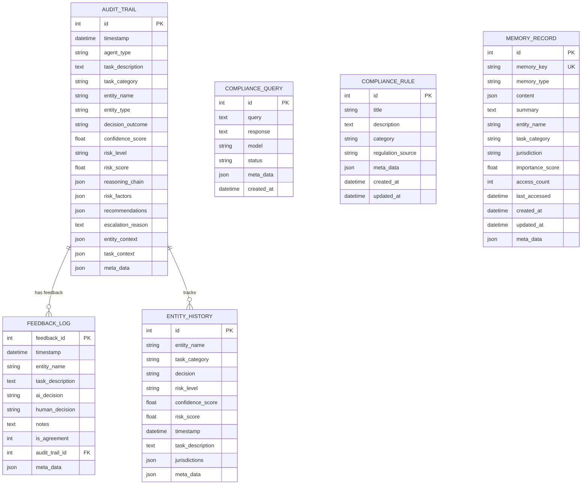

# Database Design - Agentic Compliance Assistant

**Version:** 2.0  
**Last Updated:** November 2025

---

## Overview

SQLite (development) / PostgreSQL (production) database with SQLAlchemy ORM. All tables use timezone-aware timestamps and JSON columns for flexible data storage.

---

## Database Schema



---

## Tables

### 1. `audit_trail`

**Purpose:** Complete audit log of all compliance decisions.

**Columns:**

| Column | Type | Nullable | Index | Description |
|--------|------|----------|-------|-------------|
| `id` | Integer | No | PK | Primary key |
| `timestamp` | DateTime(timezone) | No | Yes | Decision timestamp |
| `agent_type` | String(100) | No | Yes | 'decision_engine' or 'openai_agent' |
| `task_description` | Text | No | No | Task description |
| `task_category` | String(100) | Yes | Yes | Task category |
| `entity_name` | String(255) | Yes | Yes | Entity name |
| `entity_type` | String(100) | Yes | No | Entity type |
| `decision_outcome` | String(50) | No | Yes | AUTONOMOUS, REVIEW_REQUIRED, ESCALATE |
| `confidence_score` | Float | No | No | Confidence (0-1) |
| `risk_level` | String(50) | Yes | Yes | LOW, MEDIUM, HIGH |
| `risk_score` | Float | Yes | No | Overall risk score (0-1) |
| `reasoning_chain` | JSON | No | No | Array of reasoning steps |
| `risk_factors` | JSON | Yes | No | Detailed risk breakdown |
| `recommendations` | JSON | Yes | No | Action recommendations |
| `escalation_reason` | Text | Yes | No | Reason for escalation |
| `entity_context` | JSON | Yes | No | Full entity context |
| `task_context` | JSON | Yes | No | Full task context |
| `meta_data` | JSON | Yes | No | Additional metadata |

**Indexes:**
- Primary: `id`
- Indexed: `timestamp`, `agent_type`, `task_category`, `entity_name`, `decision_outcome`, `risk_level`

**Relationships:**
- One-to-many with `feedback_log` (via `audit_trail_id`)

---

### 2. `feedback_log`

**Purpose:** Human feedback on AI decisions for learning.

**Columns:**

| Column | Type | Nullable | Index | Description |
|--------|------|----------|-------|-------------|
| `feedback_id` | Integer | No | PK | Primary key |
| `timestamp` | DateTime(timezone) | No | Yes | Feedback timestamp |
| `entity_name` | String(255) | Yes | Yes | Entity name |
| `task_description` | Text | No | No | Task description |
| `ai_decision` | String(50) | No | Yes | AI decision |
| `human_decision` | String(50) | No | Yes | Human decision |
| `notes` | Text | Yes | No | Feedback notes |
| `is_agreement` | Integer | No | No | 1 if agreement, 0 if disagreement |
| `audit_trail_id` | Integer | Yes | Yes | Link to audit trail |
| `meta_data` | JSON | Yes | No | Additional metadata |

**Indexes:**
- Primary: `feedback_id`
- Indexed: `timestamp`, `entity_name`, `ai_decision`, `human_decision`, `audit_trail_id`

**Relationships:**
- Many-to-one with `audit_trail` (via `audit_trail_id`)

---

### 3. `entity_history`

**Purpose:** Historical tracking of entity compliance decisions.

**Columns:**

| Column | Type | Nullable | Index | Description |
|--------|------|----------|-------|-------------|
| `id` | Integer | No | PK | Primary key |
| `entity_name` | String(255) | No | Yes | Entity name |
| `task_category` | String(100) | No | Yes | Task category |
| `decision` | String(50) | No | Yes | Decision outcome |
| `risk_level` | String(50) | Yes | Yes | Risk level |
| `confidence_score` | Float | Yes | No | Confidence (0-1) |
| `risk_score` | Float | Yes | No | Risk score (0-1) |
| `timestamp` | DateTime(timezone) | No | Yes | Decision timestamp |
| `task_description` | Text | Yes | No | Task description |
| `jurisdictions` | JSON | Yes | No | Jurisdiction list |
| `meta_data` | JSON | Yes | No | Additional metadata |

**Indexes:**
- Primary: `id`
- Indexed: `entity_name`, `task_category`, `decision`, `risk_level`, `timestamp`

---

### 4. `compliance_queries`

**Purpose:** Store compliance queries and responses.

**Columns:**

| Column | Type | Nullable | Index | Description |
|--------|------|----------|-------|-------------|
| `id` | Integer | No | PK | Primary key |
| `query` | Text | No | No | Query text |
| `response` | Text | No | No | Response text |
| `model` | String(100) | No | No | Model used |
| `status` | String(50) | No | No | Query status |
| `meta_data` | JSON | Yes | No | Additional metadata |
| `created_at` | DateTime(timezone) | No | No | Creation timestamp |

**Indexes:**
- Primary: `id`

---

### 5. `compliance_rules`

**Purpose:** Store compliance rules and regulations.

**Columns:**

| Column | Type | Nullable | Index | Description |
|--------|------|----------|-------|-------------|
| `id` | Integer | No | PK | Primary key |
| `title` | String(255) | No | No | Rule title |
| `description` | Text | No | No | Rule description |
| `category` | String(100) | Yes | No | Rule category |
| `regulation_source` | String(255) | Yes | No | Source regulation |
| `meta_data` | JSON | Yes | No | Additional metadata |
| `created_at` | DateTime(timezone) | No | No | Creation timestamp |
| `updated_at` | DateTime(timezone) | No | No | Update timestamp |

**Indexes:**
- Primary: `id`

---

### 6. `memory_records`

**Purpose:** Agentic engine memory storage (experimental).

**Columns:**

| Column | Type | Nullable | Index | Description |
|--------|------|----------|-------|-------------|
| `id` | Integer | No | PK | Primary key |
| `memory_key` | String(255) | No | UK | Unique memory key |
| `memory_type` | String(50) | No | Yes | episodic, semantic, working |
| `content` | JSON | No | No | Memory content |
| `summary` | Text | Yes | No | Human-readable summary |
| `entity_name` | String(255) | Yes | Yes | Entity name |
| `task_category` | String(100) | Yes | Yes | Task category |
| `jurisdiction` | String(100) | Yes | Yes | Jurisdiction |
| `importance_score` | Float | Yes | No | Importance (0-1) |
| `access_count` | Integer | No | No | Access count |
| `last_accessed` | DateTime(timezone) | No | No | Last access time |
| `created_at` | DateTime(timezone) | No | No | Creation timestamp |
| `updated_at` | DateTime(timezone) | No | No | Update timestamp |
| `meta_data` | JSON | Yes | No | Additional metadata |

**Indexes:**
- Primary: `id`
- Unique: `memory_key`
- Indexed: `memory_type`, `entity_name`, `task_category`, `jurisdiction`

---

## Data Types

### Enums

**Decision Outcomes:**
- `AUTONOMOUS` - Low risk, can proceed autonomously
- `REVIEW_REQUIRED` - Medium risk, requires human review
- `ESCALATE` - High risk, escalate to expert

**Risk Levels:**
- `LOW` - Low risk
- `MEDIUM` - Medium risk
- `HIGH` - High risk

**Agent Types:**
- `decision_engine` - Standard decision engine
- `openai_agent` - OpenAI-powered agent

**Memory Types:**
- `episodic` - Event-based memory
- `semantic` - Knowledge-based memory
- `working` - Temporary working memory

---

## JSON Column Structures

### `reasoning_chain` (audit_trail)

```json
[
    "Step 1: Analyzed jurisdiction requirements",
    "Step 2: Assessed entity risk profile",
    "Step 3: Evaluated task complexity"
]
```

### `risk_factors` (audit_trail)

```json
{
    "jurisdiction_risk": 0.7,
    "entity_risk": 0.5,
    "task_risk": 0.6,
    "data_sensitivity_risk": 0.8,
    "regulatory_risk": 0.4,
    "impact_risk": 0.3
}
```

### `recommendations` (audit_trail)

```json
[
    "Review data handling procedures",
    "Consult with legal team",
    "Implement additional safeguards"
]
```

### `entity_context` (audit_trail)

```json
{
    "name": "TechCorp",
    "entity_type": "PRIVATE_COMPANY",
    "industry": "TECHNOLOGY",
    "jurisdictions": ["US_FEDERAL", "EU"],
    "has_personal_data": true,
    "is_regulated": false,
    "previous_violations": 0
}
```

### `task_context` (audit_trail)

```json
{
    "description": "Implement GDPR compliance",
    "category": "DATA_PRIVACY",
    "affects_personal_data": true,
    "affects_financial_data": false,
    "involves_cross_border": true
}
```

---

## Indexes

### Performance Indexes

**audit_trail:**
- `timestamp` - For time-based queries
- `agent_type` - For filtering by agent
- `task_category` - For category filtering
- `entity_name` - For entity lookups
- `decision_outcome` - For decision filtering
- `risk_level` - For risk filtering

**feedback_log:**
- `timestamp` - For time-based queries
- `entity_name` - For entity lookups
- `ai_decision` - For AI decision filtering
- `human_decision` - For human decision filtering
- `audit_trail_id` - For joining with audit_trail

**entity_history:**
- `entity_name` - For entity lookups
- `task_category` - For category filtering
- `decision` - For decision filtering
- `risk_level` - For risk filtering
- `timestamp` - For time-based queries

---

## Queries

### Common Queries

**Get recent audit entries:**
```sql
SELECT * FROM audit_trail
WHERE timestamp >= NOW() - INTERVAL '7 days'
ORDER BY timestamp DESC
LIMIT 100;
```

**Get entity history:**
```sql
SELECT * FROM entity_history
WHERE entity_name = 'TechCorp'
ORDER BY timestamp DESC;
```

**Get feedback for audit entry:**
```sql
SELECT * FROM feedback_log
WHERE audit_trail_id = ?
ORDER BY timestamp DESC;
```

**Get decision statistics:**
```sql
SELECT 
    decision_outcome,
    COUNT(*) as count,
    AVG(confidence_score) as avg_confidence
FROM audit_trail
WHERE timestamp >= NOW() - INTERVAL '30 days'
GROUP BY decision_outcome;
```

---

## Migration

### SQLite to PostgreSQL

**Differences:**
- SQLite: `INTEGER PRIMARY KEY`
- PostgreSQL: `SERIAL PRIMARY KEY`

**JSON Support:**
- SQLite: JSON stored as TEXT
- PostgreSQL: Native JSONB type

**Timezone:**
- Both support timezone-aware timestamps
- Use `DateTime(timezone=True)` in SQLAlchemy

---

## Backup & Recovery

### Backup Strategy

1. **Regular Backups:** Daily automated backups
2. **Transaction Logs:** Enable WAL mode (SQLite) or WAL archiving (PostgreSQL)
3. **Point-in-Time Recovery:** Use transaction logs for recovery

### Recovery Procedures

1. Restore from latest backup
2. Apply transaction logs if available
3. Verify data integrity
4. Test application functionality

---

*Last Updated: November 2025*  
*Database Design Version: 2.0*

