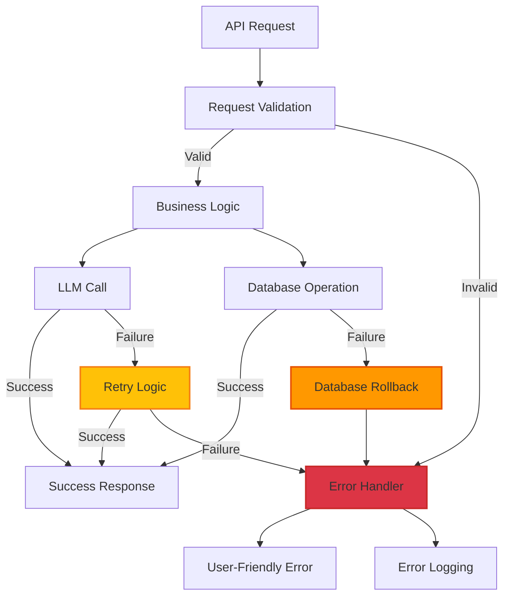

# Error Recovery - Agentic Compliance Assistant

**Version:** 2.0  
**Last Updated:** November 2025

---

## Overview

Comprehensive error handling and recovery system ensuring system stability and user-friendly error messages.

---

## Error Handling Architecture



---

## Error Types

### 1. ValidationError

**Cause:** Request validation failed (Pydantic)

**Handling:**
```python
from fastapi import HTTPException
from pydantic import ValidationError

try:
    request = DecisionRequest(**data)
except ValidationError as e:
    raise HTTPException(
        status_code=422,
        detail={
            "type": "ValidationError",
            "message": "Request validation failed",
            "errors": e.errors()
        }
    )
```

**User Message:**
```
"Please check your input. Some fields are missing or invalid."
```

---

### 2. AnalysisError

**Cause:** Decision analysis failed

**Handling:**
```python
try:
    analysis = decision_engine.analyze_and_decide(entity, task)
except Exception as e:
    logger.error(f"Analysis failed: {e}", exc_info=True)
    raise HTTPException(
        status_code=500,
        detail={
            "type": "AnalysisError",
            "message": "Failed to analyze compliance task",
            "details": str(e) if settings.DEBUG else None
        }
    )
```

**User Message:**
```
"Unable to analyze this task. Please try again or contact support."
```

---

### 3. DatabaseError

**Cause:** Database operation failed

**Handling:**
```python
from sqlalchemy.exc import SQLAlchemyError

try:
    db.add(audit_entry)
    db.commit()
except SQLAlchemyError as e:
    db.rollback()
    logger.error(f"Database error: {e}", exc_info=True)
    raise HTTPException(
        status_code=500,
        detail={
            "type": "DatabaseError",
            "message": "Database operation failed",
            "details": str(e) if settings.DEBUG else None
        }
    )
```

**User Message:**
```
"Unable to save data. Please try again."
```

---

### 4. LLMError

**Cause:** LLM call failed

**Handling:**
```python
from backend.utils.llm_client import run_compliance_analysis

response = run_compliance_analysis(prompt)
if response.status == "error":
    logger.error(f"LLM error: {response.error}")
    raise HTTPException(
        status_code=503,
        detail={
            "type": "LLMError",
            "message": "AI service temporarily unavailable",
            "details": response.error if settings.DEBUG else None
        }
    )
```

**User Message:**
```
"AI service is temporarily unavailable. Please try again in a moment."
```

---

### 5. AuthenticationError

**Cause:** Authentication failed

**Handling:**
```python
from fastapi import HTTPException, Depends
from backend.auth.security import get_current_user

@router.post("/analyze")
async def analyze(
    request: DecisionRequest,
    current_user: User = Depends(get_current_user)
):
    # User is authenticated
    ...
```

**User Message:**
```
"Authentication required. Please log in."
```

---

## Retry Logic

### LLM Retries

**Implementation:**
```python
# backend/utils/llm_client.py

MAX_RETRIES = 2
TIMEOUT = 45.0

for attempt in range(MAX_RETRIES + 1):
    try:
        response = client.chat.completions.create(**params)
        return LLMResponse(status="completed", ...)
    except Exception as e:
        if attempt == MAX_RETRIES:
            return LLMResponse(status="error", error=str(e))
        wait_time = 2 ** attempt  # Exponential backoff
        time.sleep(wait_time)
```

**Retry Strategy:**
- Attempt 1: Immediate
- Attempt 2: Wait 1 second
- Attempt 3: Wait 2 seconds
- Final: Return error

---

### Database Retries

**Implementation:**
```python
MAX_DB_RETRIES = 3

for attempt in range(MAX_DB_RETRIES):
    try:
        db.add(entry)
        db.commit()
        break
    except SQLAlchemyError as e:
        db.rollback()
        if attempt == MAX_DB_RETRIES - 1:
            raise
        time.sleep(0.1 * (attempt + 1))
```

---

## Error Recovery Strategies

### 1. Graceful Degradation

**LLM Unavailable:**
```python
response = run_compliance_analysis(prompt)
if response.status == "error":
    # Fallback to rule-based analysis
    analysis = fallback_rule_based_analysis(entity, task)
    return analysis
```

**Database Unavailable:**
```python
try:
    save_audit_entry(entry)
except DatabaseError:
    # Log to file as backup
    log_to_file(entry)
    # Continue with response
    return response
```

---

### 2. Circuit Breaker

**Implementation:**
```python
class CircuitBreaker:
    def __init__(self, failure_threshold=5, timeout=60):
        self.failure_count = 0
        self.failure_threshold = failure_threshold
        self.timeout = timeout
        self.last_failure_time = None
        self.state = "closed"  # closed, open, half_open
    
    def call(self, func, *args, **kwargs):
        if self.state == "open":
            if time.time() - self.last_failure_time > self.timeout:
                self.state = "half_open"
            else:
                raise CircuitBreakerOpen("Circuit breaker is open")
        
        try:
            result = func(*args, **kwargs)
            if self.state == "half_open":
                self.state = "closed"
                self.failure_count = 0
            return result
        except Exception as e:
            self.failure_count += 1
            self.last_failure_time = time.time()
            if self.failure_count >= self.failure_threshold:
                self.state = "open"
            raise
```

---

### 3. Timeout Handling

**LLM Timeout:**
```python
try:
    response = await asyncio.wait_for(
        run_compliance_analysis_async(prompt),
        timeout=45.0
    )
except asyncio.TimeoutError:
    return LLMResponse(
        status="timeout",
        error="Request timed out after 45 seconds"
    )
```

**Database Timeout:**
```python
from sqlalchemy import event
from sqlalchemy.pool import Pool

@event.listens_for(Pool, "connect")
def set_sqlite_timeout(dbapi_conn, connection_record):
    dbapi_conn.execute("PRAGMA busy_timeout = 30000")  # 30 seconds
```

---

## Error Logging

### Structured Logging

```python
import logging
import json

logger = logging.getLogger(__name__)

def log_error(error_type, message, details=None, exc_info=None):
    log_data = {
        "error_type": error_type,
        "message": message,
        "timestamp": datetime.utcnow().isoformat(),
        "details": details
    }
    
    if exc_info:
        logger.error(json.dumps(log_data), exc_info=exc_info)
    else:
        logger.error(json.dumps(log_data))
```

---

## User-Friendly Error Messages

### Error Message Mapping

```python
ERROR_MESSAGES = {
    "ValidationError": "Please check your input and try again.",
    "AnalysisError": "Unable to analyze this task. Please try again.",
    "DatabaseError": "Unable to save data. Please try again.",
    "LLMError": "AI service is temporarily unavailable. Please try again in a moment.",
    "AuthenticationError": "Authentication required. Please log in.",
    "TimeoutError": "Request timed out. Please try again with a simpler query.",
    "RateLimitError": "Too many requests. Please wait a moment and try again."
}
```

### Frontend Error Display

```python
# frontend/components/api_client.py

def display_api_error(response):
    error = response.get("error", {})
    error_type = error.get("type", "UnknownError")
    message = ERROR_MESSAGES.get(error_type, "An error occurred. Please try again.")
    
    st.error(f"**{error_type}**: {message}")
    
    if settings.DEBUG:
        with st.expander("Error Details"):
            st.json(error)
```

---

## Error Recovery Simulator

### Purpose

Test system resilience by simulating various failure scenarios.

### Implementation

**Location:** `frontend/pages/8_Error_Recovery_Simulator.py`

**Features:**
- Simulate LLM failures
- Simulate database failures
- Simulate timeout scenarios
- Measure recovery success rate

**Usage:**
1. Select failure type
2. Set failure rate
3. Run simulation
4. View recovery metrics

---

## Monitoring & Alerting

### Error Metrics

**Track:**
- Error rate by type
- Recovery success rate
- Average recovery time
- Circuit breaker state

**Alerts:**
- Error rate > 5%: Warning
- Error rate > 10%: Critical
- Circuit breaker open: Critical
- Database errors: Critical

---

## Best Practices

1. **Always validate input** - Catch errors early
2. **Use retries** - For transient failures
3. **Log errors** - With context and stack traces
4. **User-friendly messages** - Never expose internal errors
5. **Graceful degradation** - Fallback when possible
6. **Circuit breakers** - Prevent cascade failures
7. **Timeouts** - Prevent hanging requests
8. **Database rollback** - On errors
9. **Error recovery testing** - Regular simulations

---

*Last Updated: November 2025*  
*Error Recovery Version: 2.0*

