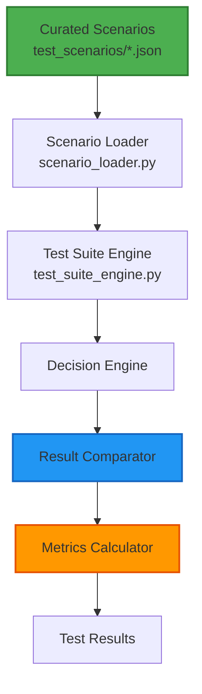

# Test Suite Design - Agentic Compliance Assistant

**Version:** 2.0  
**Last Updated:** November 2025

---

## Overview

Curated test scenarios with expected outcomes. Compares actual vs expected results and calculates accuracy metrics.

---

## Architecture



---

## Scenario Format

### JSON Structure

```json
{
    "title": "Scenario Title",
    "description": "Scenario description",
    "input": {
        "entity": {
            "name": "EntityName",
            "entity_type": "PRIVATE_COMPANY",
            "locations": ["US_FEDERAL", "EU"],
            "industry": "TECHNOLOGY",
            "has_personal_data": true,
            "is_regulated": false,
            "previous_violations": 0
        },
        "task": {
            "description": "Task description",
            "category": "DATA_PRIVACY"
        }
    },
    "expected_decision": "REVIEW_REQUIRED",
    "expected_risk_level": "MEDIUM",
    "expected_min_confidence": 0.65
}
```

### Required Fields

- `input` - Entity and task context
- `expected_decision` - Expected decision outcome
- `expected_risk_level` - Expected risk level
- `expected_min_confidence` - Minimum confidence threshold

---

## Test Execution Flow

```
1. Load scenarios from test_scenarios/*.json
   ↓
2. For each scenario:
   a. Extract input (entity, task)
   b. Create EntityContext and TaskContext
   c. Run Decision Engine
   d. Get actual result
   ↓
3. Compare actual vs expected:
   - Decision match?
   - Risk level match?
   - Confidence >= minimum?
   ↓
4. Calculate scores:
   - Pass/fail
   - Decision accuracy
   - Risk level accuracy
   - Confidence adequacy
   ↓
5. Generate results:
   - Pass rate
   - Failures with diffs
   - Confidence deviations
```

---

## Result Comparison

### TestResult Class

```python
class TestResult:
    scenario: Dict[str, Any]
    actual_result: DecisionAnalysis
    expected_decision: str
    expected_risk_level: str
    expected_min_confidence: float
    
    # Actual values
    actual_decision: str
    actual_risk_level: str
    actual_confidence: float
    
    # Scoring
    decision_correct: bool
    risk_level_correct: bool
    confidence_adequate: bool
    passed: bool  # All three must be True
    
    def get_diff(self) -> Dict[str, Any]:
        # Returns differences for failures
```

### Comparison Logic

**Decision:**
```python
decision_correct = (actual_decision == expected_decision)
```

**Risk Level:**
```python
risk_level_correct = (actual_risk_level == expected_risk_level)
```

**Confidence:**
```python
confidence_adequate = (actual_confidence >= expected_min_confidence)
```

**Overall Pass:**
```python
passed = decision_correct and risk_level_correct and confidence_adequate
```

---

## Metrics Calculation

### Summary Metrics

```python
{
    "total_tests": int,
    "passed_tests": int,
    "failed_tests": int,
    "pass_rate": float,  # passed_tests / total_tests
    "decision_accuracy": float,  # decision_correct / total_tests
    "risk_level_accuracy": float,  # risk_level_correct / total_tests
    "confidence_adequacy": float,  # confidence_adequate / total_tests
    "avg_execution_time": float,
    "confidence_deviations": [
        {
            "scenario": str,
            "expected_min": float,
            "actual": float,
            "deviation": float,
            "adequate": bool
        },
        ...
    ],
    "failures": [
        {
            "scenario": str,
            "diff": {
                "decision": {"expected": str, "actual": str},
                "risk_level": {"expected": str, "actual": str},
                "confidence": {"expected_min": float, "actual": float, "deviation": float}
            },
            "error": str
        },
        ...
    ]
}
```

---

## Scenario Examples

### 1. GDPR Article 30

```json
{
    "title": "GDPR Article 30 Records",
    "description": "Test basic GDPR Article 30 records requirement",
    "input": {
        "entity": {
            "name": "TestCorp",
            "entity_type": "PRIVATE_COMPANY",
            "locations": ["EU"],
            "industry": "TECHNOLOGY",
            "has_personal_data": true,
            "is_regulated": false
        },
        "task": {
            "description": "Implement GDPR Article 30 records of processing activities",
            "category": "DATA_PRIVACY"
        }
    },
    "expected_decision": "REVIEW_REQUIRED",
    "expected_risk_level": "MEDIUM",
    "expected_min_confidence": 0.65
}
```

### 2. Multi-Jurisdiction

```json
{
    "title": "Multi-Jurisdiction Compliance",
    "description": "Test compliance across multiple jurisdictions",
    "input": {
        "entity": {
            "name": "GlobalTech",
            "entity_type": "PRIVATE_COMPANY",
            "locations": ["US_FEDERAL", "EU", "UK"],
            "industry": "TECHNOLOGY",
            "has_personal_data": true,
            "is_regulated": true
        },
        "task": {
            "description": "Analyze compliance requirements for US, EU, and UK operations",
            "category": "DATA_PRIVACY"
        }
    },
    "expected_decision": "REVIEW_REQUIRED",
    "expected_risk_level": "HIGH",
    "expected_min_confidence": 0.70
}
```

### 3. High-Risk Entity

```json
{
    "title": "High-Risk Entity Analysis",
    "description": "Test analysis for high-risk entity with violations",
    "input": {
        "entity": {
            "name": "RiskCorp",
            "entity_type": "PRIVATE_COMPANY",
            "locations": ["US_FEDERAL", "EU"],
            "industry": "FINANCIAL_SERVICES",
            "has_personal_data": true,
            "is_regulated": true,
            "previous_violations": 3
        },
        "task": {
            "description": "Comprehensive risk assessment for entity with previous violations",
            "category": "RISK_ASSESSMENT"
        }
    },
    "expected_decision": "ESCALATE",
    "expected_risk_level": "HIGH",
    "expected_min_confidence": 0.75
}
```

---

## API Integration

### Endpoint

**POST `/api/v1/agentic/testSuite`**

**Request:**
```json
{
    "scenarios_dir": null  // Optional, defaults to test_scenarios/
}
```

**Response:**
```json
{
    "status": "completed",
    "results": {
        "test_results": [...],
        "summary": {
            "total_tests": 5,
            "passed_tests": 4,
            "failed_tests": 1,
            "pass_rate": 0.8,
            "decision_accuracy": 0.8,
            "risk_level_accuracy": 0.8,
            "confidence_adequacy": 1.0,
            "avg_execution_time": 2.5,
            "confidence_deviations": [...],
            "failures": [...]
        },
        "timestamp": "2024-12-01T12:00:00Z"
    },
    "error": null,
    "timestamp": "2024-12-01T12:00:00Z"
}
```

---

## Frontend Display

### Test Suite Page

**Location:** `frontend/pages/7_Agentic_Test_Suite.py`

**Features:**
- Run test suite button
- Summary metrics display
- Pass rate visualization
- Failures with detailed diffs
- Confidence deviation chart
- Detailed results table

### Metrics Display

**Summary Cards:**
- Total Tests
- Pass Rate (with delta)
- Decision Accuracy
- Risk Level Accuracy
- Confidence Adequacy

**Failures Section:**
- Expandable failure details
- Expected vs Actual comparison
- Difference highlighting

**Confidence Deviations:**
- Bar chart showing deviations
- Table with all deviation data
- Color-coded (green=adequate, red=inadequate)

---

## Adding New Scenarios

### Steps

1. Create JSON file in `/test_scenarios/`
2. Follow scenario format
3. Set expected values based on:
   - Decision engine behavior
   - Risk model calculations
   - Historical results
4. Test scenario manually first
5. Add to test suite

### Example

```bash
# Create new scenario
cat > test_scenarios/new_scenario.json << EOF
{
    "title": "New Scenario",
    "description": "Description",
    "input": {
        "entity": {...},
        "task": {...}
    },
    "expected_decision": "AUTONOMOUS",
    "expected_risk_level": "LOW",
    "expected_min_confidence": 0.80
}
EOF
```

---

## Best Practices

1. **Curated Scenarios** - No random generation
2. **Realistic Expectations** - Based on actual behavior
3. **Comprehensive Coverage** - Various scenarios
4. **Clear Diffs** - Easy to understand failures
5. **Regular Updates** - Update scenarios as system evolves
6. **Documentation** - Document why each scenario exists

---

*Last Updated: November 2025*  
*Test Suite Design Version: 2.0*

