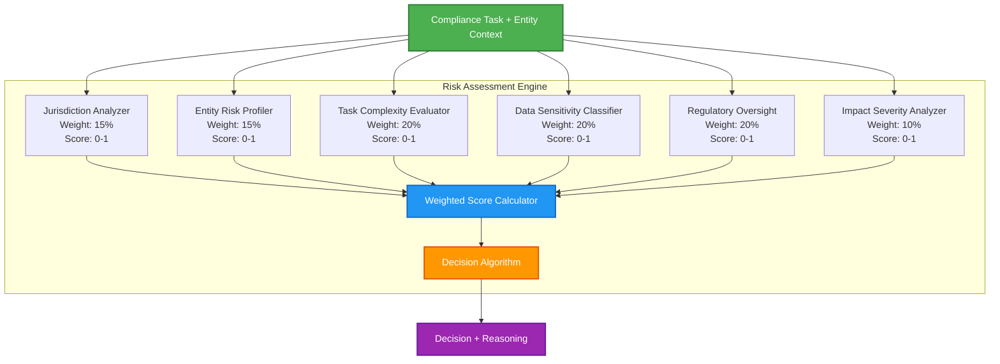
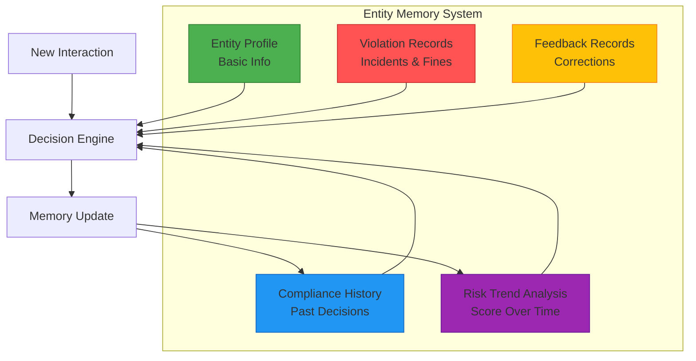
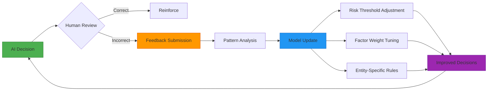
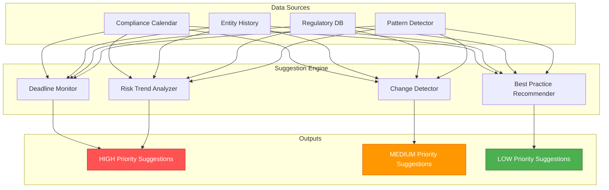
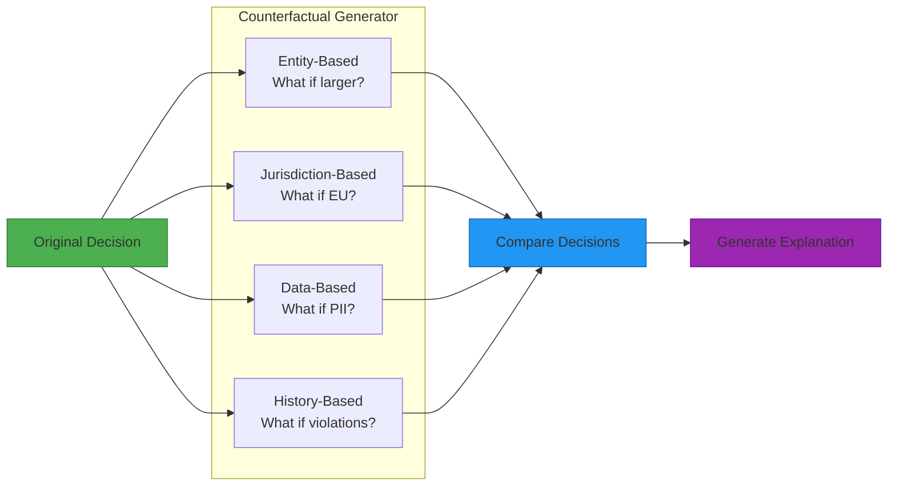
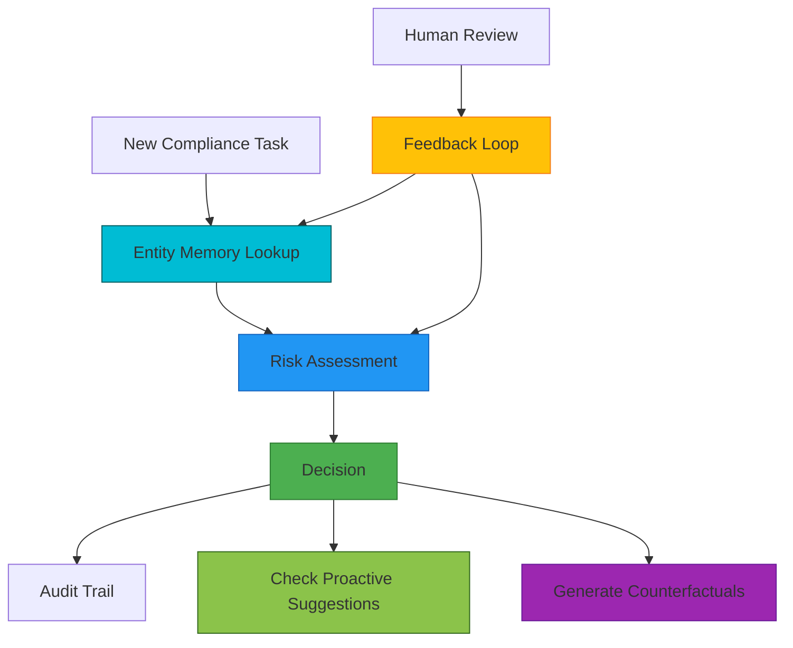
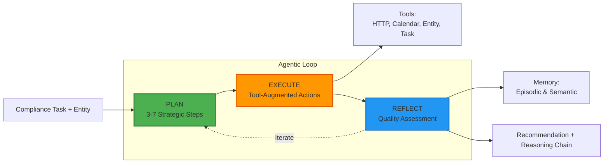

# Feature Overview

**Last Updated:** November 2025  
**Version:** 1.0

---

## Introduction

The AI Agentic Compliance Assistant implements **five core agentic features** that enable intelligent, autonomous compliance management with human oversight. These features work together to create a system that learns from experience, anticipates needs, and continuously improves its decision-making accuracy.

This document provides detailed overviews of each agentic feature, including workflows, diagrams, and real-world examples.

---

## Agentic Features

1. [6-Factor Risk Assessment Engine](#1-6-factor-risk-assessment-engine)
2. [Entity Memory System](#2-entity-memory-system)
3. [Human Feedback Loop](#3-human-feedback-loop)
4. [Proactive Suggestion Engine](#4-proactive-suggestion-engine)
5. [Counterfactual Reasoning](#5-counterfactual-reasoning)
6. [🧪 Experimental Agentic AI Engine](#6-experimental-agentic-ai-engine)

---

## 1. 6-Factor Risk Assessment Engine

### Overview

The **Risk Assessment Engine** is the core decision-making component that evaluates every compliance task across six weighted dimensions to determine whether the AI agent can act autonomously or requires human oversight.

### Architecture



### How It Works

#### Step 1: Factor Analysis

Each factor independently analyzes the task:

**Jurisdiction Analyzer (15%)**
- Single jurisdiction → Low score (0.2)
- Multiple jurisdictions → Medium score (0.5)
- Conflicting regulations → High score (0.8)

**Entity Risk Profiler (15%)**
- Clean history, low risk → Low score (0.2)
- Some violations, medium maturity → Medium score (0.5)
- Multiple violations, high-risk industry → High score (0.9)

**Task Complexity (20%)**
- General inquiry → Low score (0.1)
- Policy review → Medium score (0.6)
- Regulatory filing → High score (0.8)

**Data Sensitivity (20%)**
- No sensitive data → Low score (0.1)
- PII involved → Medium score (0.6)
- PII + financial data → High score (0.9)

**Regulatory Oversight (20%)**
- Not regulated → Low score (0.2)
- Industry-regulated → Medium score (0.6)
- Direct government oversight → High score (0.9)

**Impact Severity (10%)**
- <10 people affected → Low score (0.2)
- 10-1000 people → Medium score (0.5)
- >1000 people → High score (0.9)

#### Step 2: Weighted Calculation

```
Risk Score = (F1 × 0.15) + (F2 × 0.15) + (F3 × 0.20) + 
             (F4 × 0.20) + (F5 × 0.20) + (F6 × 0.10)
```

#### Step 3: Decision Mapping

```
if Risk Score < 0.4:
    Decision = AUTONOMOUS ✅
elif 0.4 ≤ Risk Score ≤ 0.7:
    Decision = REVIEW_REQUIRED ⚠️
else:
    Decision = ESCALATE 🚨
```

### Workflow Example

**Scenario: Small startup asking about GDPR data retention**

```
Input:
  Entity: TechStartup Inc
    - Type: STARTUP
    - Employees: 20
    - Jurisdiction: US_FEDERAL
    - Violations: 0
    - Regulated: false
    
  Task: "What is the required data retention period under GDPR?"
    - Category: GENERAL_INQUIRY
    - Personal Data: false
    - Cross-border: false

Factor Analysis:
  F1 (Jurisdiction): 0.20 — Single jurisdiction, basic question
  F2 (Entity Risk): 0.15 — Small startup, clean record
  F3 (Task Complexity): 0.10 — Simple informational query
  F4 (Data Sensitivity): 0.10 — No actual data involved
  F5 (Regulatory Oversight): 0.20 — Not regulated
  F6 (Impact): 0.10 — Very low impact

Calculation:
  Risk Score = (0.20×0.15) + (0.15×0.15) + (0.10×0.20) + 
               (0.10×0.20) + (0.20×0.20) + (0.10×0.10)
  Risk Score = 0.03 + 0.0225 + 0.02 + 0.02 + 0.04 + 0.01
  Risk Score = 0.1425

Decision: AUTONOMOUS ✅

Output:
  "The GDPR does not mandate specific retention periods. Instead, 
   Article 5(1)(e) requires that personal data be kept only as long as 
   necessary for the purposes for which it was collected. Organizations 
   must define retention periods based on legitimate needs and document 
   their rationale."
```

### Key Features

- ✅ **Transparent** — Every factor score is visible and explainable
- ✅ **Tunable** — Weights can be adjusted based on organizational risk tolerance
- ✅ **Consistent** — Same inputs always produce same scores
- ✅ **Comprehensive** — Covers all major compliance dimensions

---

## 2. Entity Memory System

### Overview

The **Entity Memory System** maintains a persistent record of every organization's compliance history, enabling the AI to make increasingly accurate and personalized decisions over time.

### Architecture



### How It Works

#### Memory Storage

Every entity interaction creates or updates a memory record:

```json
{
  "entity_id": "tech_corp_123",
  "first_seen": "2024-01-15",
  "interactions": 47,
  "decisions": {
    "autonomous": 35,
    "review": 10,
    "escalate": 2
  },
  "risk_evolution": [
    {"date": "2024-01", "score": 0.35},
    {"date": "2024-06", "score": 0.82},
    {"date": "2025-01", "score": 0.42}
  ]
}
```

#### Memory Retrieval

When a new task arrives:

1. **Lookup Entity** — Check if entity exists in memory
2. **Load Context** — Retrieve full history
3. **Analyze Trends** — Is risk increasing or decreasing?
4. **Apply Context** — Adjust risk factors based on history
5. **Make Decision** — Use enriched context for better accuracy

### Workflow Example

**Scenario: Repeat entity with improving compliance**

```
Interaction 1 (Jan 2024):
  Entity: TechCorp (new to system)
  Task: General GDPR inquiry
  Memory: None
  Decision: AUTONOMOUS (score: 0.35)
  
Interaction 2 (Jun 2024):
  Entity: TechCorp
  Task: Data breach incident
  Memory: 1 previous interaction
  Decision: ESCALATE (score: 0.89)
  Update: Violation recorded

Interaction 3 (Jul 2024):
  Entity: TechCorp
  Task: Policy update after breach
  Memory: 2 interactions, 1 violation
  Adjustment: Risk elevated due to recent violation
  Decision: REVIEW_REQUIRED (score: 0.68)
  
Interaction 4 (Jan 2025):
  Entity: TechCorp
  Task: Routine compliance check
  Memory: 46 interactions, 1 resolved violation
  Trend Analysis: Risk declining (0.82 → 0.42)
  Adjustment: Risk lowered due to good remediation
  Decision: AUTONOMOUS (score: 0.42)
  Confidence: HIGHER (history of improvement)
```

### Key Features

- 🧠 **Persistent** — Never forgets entity history
- 📈 **Adaptive** — Decisions improve with more data
- 🎯 **Personalized** — Tailored to each entity's journey
- 🔍 **Transparent** — Full history visible for auditing

### Benefits

| Before Memory | With Memory |
|---------------|-------------|
| Treats every entity the same | Personalized risk assessment |
| No context from past | Rich historical context |
| Cannot detect patterns | Identifies improving/declining trends |
| Generic recommendations | Entity-specific suggestions |

---

## 3. Human Feedback Loop

### Overview

The **Human Feedback Loop** enables continuous learning by capturing when human experts disagree with AI decisions and using those corrections to improve future accuracy.

### Architecture



### How It Works

#### Step 1: Decision Review

Human compliance officer reviews AI decision:

```
AI Decision: AUTONOMOUS
Risk Score: 0.38
Task: "Update employee data retention policy"

Reviewer Assessment: ❌ INCORRECT
Correct Decision: REVIEW_REQUIRED
Reason: "Policy affects 5000 employees, should require review"
```

#### Step 2: Feedback Submission

```json
{
  "decision_id": "dec_20250113_001",
  "original_decision": "AUTONOMOUS",
  "correct_decision": "REVIEW_REQUIRED",
  "severity": "MEDIUM",
  "factor_corrections": {
    "impact_severity": {
      "ai_score": 0.30,
      "correct_score": 0.70,
      "reason": "Underestimated stakeholder count impact"
    }
  },
  "reviewer_notes": "5000+ affected employees triggers mandatory review policy"
}
```

#### Step 3: Pattern Analysis

System analyzes feedback to identify patterns:

```python
# Detect systematic bias
if feedback_count > 10:
    pattern = analyze_corrections(feedback_log)
    
    if pattern.type == "FACTOR_UNDERESTIMATION":
        # Impact severity consistently underestimated
        adjust_factor_weight(
            factor="impact_severity",
            adjustment=+0.05
        )
```

#### Step 4: Model Update

Apply learning to future decisions:

```
Before Feedback:
  Impact Factor Weight: 10%
  Stakeholder Count 5000 → Score: 0.30
  
After Feedback:
  Impact Factor Weight: 15%
  Stakeholder Count 5000 → Score: 0.70
  
Result: Better recognition of high-impact scenarios
```

### Workflow Example

**Month 1: Initial Deployment**
```
Total Decisions: 100
Human Overrides: 15 (15% error rate)
Common Issue: Underestimating multi-jurisdictional complexity
```

**Learning Applied:**
```
- Increase jurisdiction factor weight from 15% → 18%
- Add rule: "3+ jurisdictions → automatic REVIEW_REQUIRED"
- Update threshold for MEDIUM risk from 0.4 → 0.35
```

**Month 2: After Learning**
```
Total Decisions: 120
Human Overrides: 8 (6.7% error rate)
Improvement: 55% reduction in errors
```

**Month 3: Continued Refinement**
```
Total Decisions: 150
Human Overrides: 5 (3.3% error rate)
Improvement: 78% reduction from baseline
```

### Key Features

- 🔄 **Continuous** — Learning never stops
- 📊 **Measurable** — Track accuracy improvements
- 🎯 **Targeted** — Fix specific weaknesses
- 👥 **Collaborative** — Humans and AI learn together

---

## 4. Proactive Suggestion Engine

### Overview

The **Proactive Suggestion Engine** shifts compliance from reactive to predictive, identifying potential issues and upcoming obligations before they become urgent.

### Architecture



### Suggestion Types

#### 1. Deadline Monitoring

**Trigger:** Upcoming compliance obligation within 30 days

```json
{
  "type": "UPCOMING_DEADLINE",
  "priority": "HIGH",
  "deadline": "2025-02-15",
  "days_remaining": 14,
  "title": "Annual SOX Compliance Audit",
  "message": "SOX 404 internal controls assessment due in 14 days",
  "recommended_actions": [
    "Schedule management review meeting",
    "Prepare documentation of internal controls",
    "Engage external auditors",
    "Review prior year findings"
  ],
  "estimated_effort": "40-60 hours",
  "assigned_to": "Compliance Team"
}
```

#### 2. Regulatory Change Detection

**Trigger:** New regulation published or existing regulation amended

```json
{
  "type": "REGULATORY_CHANGE",
  "priority": "MEDIUM",
  "effective_date": "2025-03-01",
  "title": "GDPR Article 22 Amendments",
  "message": "New requirements for automated decision-making transparency",
  "impact_analysis": {
    "affected_processes": ["Customer credit scoring", "Hiring algorithms"],
    "required_changes": [
      "Update privacy notices",
      "Implement explanation mechanism",
      "Add human review option"
    ]
  },
  "recommended_actions": [
    "Review all automated decision systems",
    "Update data processing agreements",
    "Train staff on new requirements"
  ],
  "compliance_deadline": "2025-03-01"
}
```

#### 3. Risk Pattern Analysis

**Trigger:** Multiple similar incidents detected

```json
{
  "type": "RISK_PATTERN",
  "priority": "HIGH",
  "pattern_detected": "Data handling incidents",
  "incidents": [
    {"date": "2024-12-05", "type": "Unauthorized access"},
    {"date": "2024-12-18", "type": "Data sent to wrong recipient"},
    {"date": "2025-01-09", "type": "Unencrypted data transfer"}
  ],
  "message": "3 data handling incidents detected in 35 days",
  "root_cause_analysis": "Insufficient staff training on data protection procedures",
  "recommended_actions": [
    "Implement mandatory data handling training",
    "Review and simplify data transfer procedures",
    "Deploy data loss prevention (DLP) tools",
    "Conduct internal audit of data practices"
  ],
  "estimated_risk_reduction": "75%"
}
```

#### 4. Preventive Actions

**Trigger:** Risk trend shows increasing exposure

```json
{
  "type": "PREVENTIVE_ACTION",
  "priority": "MEDIUM",
  "trend": "Entity risk score increased 35% in 90 days",
  "current_risk": 0.62,
  "historical_risk": 0.46,
  "message": "Compliance risk trending upward",
  "contributing_factors": [
    "Expanded to new jurisdiction (EU)",
    "Increased data processing activities",
    "Higher employee count (50 → 85)"
  ],
  "recommended_actions": [
    "Schedule comprehensive compliance audit",
    "Appoint dedicated data protection officer",
    "Review and update all policies",
    "Implement compliance training program"
  ],
  "expected_outcome": "Stabilize risk, prevent escalation"
}
```

### Workflow Example

**Monday Morning: Proactive Suggestions Review**

```
Dashboard Alert: 3 High Priority Suggestions

Suggestion 1: 🚨 HIGH
  Title: "SOX Audit Due in 12 Days"
  Action: Schedule meeting today
  Status: ACKNOWLEDGED → Meeting scheduled for 2pm

Suggestion 2: 🚨 HIGH  
  Title: "5 Data Incidents in 45 Days"
  Action: Implement training program
  Status: IN_PROGRESS → Training scheduled for next week

Suggestion 3: ⚠️ MEDIUM
  Title: "GDPR Amendment Effective March 1"
  Action: Review privacy notices
  Status: ASSIGNED → Assigned to Legal team
```

### Key Features

- ⏰ **Timely** — Alerts well before deadlines
- 🎯 **Actionable** — Specific steps provided
- 📊 **Prioritized** — Focus on what matters most
- 🔮 **Predictive** — Anticipates future needs

---

## 5. Counterfactual Reasoning

### Overview

**Counterfactual Reasoning** generates "what-if" scenarios to explain why decisions were made and how they might change under different conditions, providing transparency and building trust.

### Architecture



### How It Works

#### Step 1: Original Decision

```
Entity: Small startup, 25 employees
Task: General GDPR question
Original Decision: AUTONOMOUS (Risk: 0.28)
```

#### Step 2: Generate Counterfactuals

**Counterfactual 1: Larger Entity**
```
Change: employee_count = 10,000
New Decision: REVIEW_REQUIRED (Risk: 0.52)
Explanation: "Larger entity size triggers regulatory oversight considerations"
Changed Factors: [regulatory_oversight +0.3, impact_severity +0.2]
```

**Counterfactual 2: Regulated Entity**
```
Change: is_regulated = true, entity_type = FINANCIAL_INSTITUTION
New Decision: ESCALATE (Risk: 0.78)
Explanation: "Financial institutions require expert legal review"
Changed Factors: [regulatory_oversight +0.6, entity_risk +0.3]
```

**Counterfactual 3: Multi-Jurisdictional**
```
Change: jurisdictions = [US, EU, UK, CANADA]
New Decision: REVIEW_REQUIRED (Risk: 0.61)
Explanation: "Multi-jurisdictional complexity requires coordination"
Changed Factors: [jurisdiction +0.5]
```

**Counterfactual 4: Previous Violations**
```
Change: previous_violations = 2
New Decision: REVIEW_REQUIRED (Risk: 0.55)
Explanation: "Violation history mandates additional oversight"
Changed Factors: [entity_risk +0.4]
```

### Workflow Example

**User Query:** "Why was this marked as AUTONOMOUS?"

**System Response:**
```
Original Decision: AUTONOMOUS ✅
Risk Score: 0.28
Reason: Low-risk entity, simple inquiry, clean history

Counterfactual Analysis:

If the entity had 10,000 employees instead of 25:
  → Decision would change to REVIEW_REQUIRED ⚠️
  → Risk Score: 0.52 (+0.24)
  → Reason: Larger scale triggers regulatory considerations

If the task involved personal data:
  → Decision would change to REVIEW_REQUIRED ⚠️
  → Risk Score: 0.58 (+0.30)
  → Reason: Data sensitivity requires additional review

If the entity had 2 previous violations:
  → Decision would change to REVIEW_REQUIRED ⚠️
  → Risk Score: 0.55 (+0.27)
  → Reason: Compliance history indicates higher risk

Conclusion:
  Your decision was AUTONOMOUS because:
  ✓ Small entity size (low impact)
  ✓ No sensitive data involved
  ✓ Clean compliance record
  ✓ Simple informational query
```

### Use Cases

#### 1. **Explaining Borderline Decisions**
```
Decision: REVIEW_REQUIRED (Risk: 0.42)
Question: "Why wasn't this AUTONOMOUS?"

Answer: "Your risk score of 0.42 is just above the AUTONOMOUS 
threshold of 0.40. If your entity had 1 fewer previous violation, 
the score would be 0.37 → AUTONOMOUS."
```

#### 2. **Training Compliance Staff**
```
Training Scenario: "What factors matter most?"

Show: 10 counterfactuals varying different factors
Result: Staff learn that jurisdiction + data sensitivity = biggest impact
```

#### 3. **Auditor Transparency**
```
Auditor: "Why did you escalate this case?"

Response: Show counterfactual where removing any ONE high-risk 
factor still results in ESCALATE, proving decision was robust.
```

#### 4. **Testing Decision Robustness**
```
Test: Generate 100 counterfactuals with small random changes
Result: If decision changes easily → Low confidence
        If decision stable → High confidence
```

### Key Features

- 🔍 **Transparent** — Shows decision logic clearly
- 📚 **Educational** — Helps users understand risk factors
- 🧪 **Testable** — Validates decision robustness
- 🤝 **Trust-Building** — Demonstrates AI reasoning

---

## Feature Integration

### How Features Work Together



### Example: Complete Flow

```
Step 1: Task arrives for TechCorp
  → Entity Memory: Load 46 previous interactions

Step 2: Risk Assessment
  → Use history to adjust entity risk factor
  → Calculate: Risk Score = 0.42

Step 3: Decision
  → REVIEW_REQUIRED (above 0.4 threshold)

Step 4: Proactive Check
  → Detected: 3 data incidents in 30 days
  → Generate: HIGH priority training suggestion

Step 5: Human Review
  → Officer changes to AUTONOMOUS
  → Feedback: "Risk overestimated, data not sensitive"

Step 6: Learning
  → Update: Reduce data sensitivity weight
  → Store: Entity-specific rule for TechCorp

Step 7: Counterfactual
  → Generated: "If data was PII → ESCALATE"
  → Confirms: Decision boundary was appropriate

Step 8: Audit Trail
  → Logged: Complete reasoning, feedback, counterfactuals
  → Available: For regulatory review
```

---

## Benefits Summary

| Feature | Primary Benefit | Secondary Benefit |
|---------|-----------------|-------------------|
| **Risk Assessment** | Consistent, explainable decisions | Tunable to organizational needs |
| **Entity Memory** | Personalized, context-aware | Improves accuracy over time |
| **Feedback Loop** | Continuous improvement | Measures learning velocity |
| **Proactive Suggestions** | Prevent compliance issues | Reduces reactive workload |
| **Counterfactual Reasoning** | Transparency and trust | Educational tool for staff |

---

## Performance Metrics

### Current System Performance

- **Autonomy Rate:** 60% (handles majority of routine tasks)
- **Override Rate:** <10% (human corrections declining)
- **Response Time:** <500ms average
- **Confidence Score:** 0.85 average
- **Test Coverage:** 90%+ across all features

### Target Performance (End of 2025)

- **Autonomy Rate:** 75%
- **Override Rate:** <5%
- **Response Time:** <200ms
- **Confidence Score:** 0.90 average
- **Zero false negatives** on HIGH risk tasks

---

## 6. 🧪 Experimental Agentic AI Engine

### Overview

The **Experimental Agentic AI Engine** represents a next-generation approach to compliance analysis using advanced plan-execute-reflect reasoning cycles. Unlike the existing rule-based decision engine, this system provides transparent, step-by-step reasoning with tool augmentation and iterative refinement.

**Status:** PHASE 2 Complete (Implementation + Integration), PHASE 3 Pending (Memory + Scoring)

**Key Innovation:** This engine doesn't just make a decision—it shows its work through explicit planning, execution, and self-reflection phases.

### Architecture



### How It Works

#### Phase 1: Planning
The AI generates a strategic plan by:
1. Analyzing the compliance task and entity context
2. Breaking down the problem into 3-7 actionable steps
3. Identifying required tools and dependencies
4. Establishing success criteria for each step

**Example Plan:**
```
Step 1: Identify applicable GDPR articles for the entity
Step 2: Analyze entity's data processing activities
Step 3: Map requirements to current practices
Step 4: Identify compliance gaps
Step 5: Generate prioritized recommendations
```

#### Phase 2: Execution
For each step, the AI:
1. Invokes necessary tools (HTTP, calendar, entity, task)
2. Gathers relevant facts and data
3. Performs required analysis
4. Documents findings and reasoning

**Available Tools:**
- **HTTP Tool** — External API calls for regulatory data
- **Calendar Tool** — Deadline tracking and scheduling
- **Entity Tool** — Entity history and profile analysis
- **Task Tool** — Task management and categorization

#### Phase 3: Reflection
After each step, the AI evaluates:
- **Correctness** — Is the output factually accurate?
- **Completeness** — Are all requirements addressed?
- **Compliance Risk** — Are there hidden risks?
- **Hallucination Check** — Any unsupported claims?
- **Missing Data** — What information is needed?

**Quality Metrics:**
- Quality Score: 0.0 - 1.0
- Confidence Level: Low/Medium/High
- Identified Issues: List of concerns
- Suggested Improvements: Refinement recommendations

#### Phase 4: Iteration (If Needed)
Based on reflection, the system may:
- Re-execute a step with corrections
- Add additional steps to the plan
- Request more information
- Adjust the approach

### Key Components

#### 1. Orchestrator
**Role:** Master coordinator for the agentic workflow

**Capabilities:**
- Plan generation with strategic decomposition
- Step-by-step execution management
- Quality reflection and assessment
- End-to-end workflow orchestration

#### 2. Agent Loop
**Role:** Iterative execution engine

**Capabilities:**
- Multi-step plan execution
- Tool invocation and management
- Reflection evaluation
- Memory updates

#### 3. Reasoning Engine
**Role:** LLM-powered reasoning

**Prompts:**
- **Planner Prompt** — Strategic task breakdown
- **Executor Prompt** — Action-oriented execution
- **Reflection Prompt** — Critical quality assessment

#### 4. Scoring Assistant
**Role:** Quality evaluation

**Metrics:**
- Decision quality (0-1)
- Correctness validation
- Completeness check
- Confidence scoring

#### 5. Memory System (PHASE 3)
**Role:** Learning and pattern recognition

**Types:**
- **Episodic Memory** — Specific analysis events
- **Semantic Memory** — Learned knowledge and patterns

### Use Cases

#### When to Use the Agentic Engine

**✅ Best For:**
- Complex, multi-step compliance analyses
- Novel scenarios requiring research
- Tasks needing external data sources
- Situations requiring transparent reasoning
- High-stakes decisions needing audit trails

**❌ Not Ideal For:**
- Simple yes/no decisions
- Time-critical real-time responses
- Routine, repetitive tasks
- Low-complexity inquiries

#### Example Scenario

**Task:** "Implement GDPR Article 30 records of processing activities for a 150-person tech company operating in US and EU"

**Traditional Engine Response:**
```
Decision: REVIEW_REQUIRED
Risk Score: 0.62
Reasoning: Multi-jurisdictional, data protection category, moderate complexity
```

**Agentic Engine Response:**
```
PLAN (5 steps):
1. Identify GDPR Article 30 requirements
2. Analyze entity's data processing activities
3. Determine record-keeping obligations
4. Map current vs. required documentation
5. Generate implementation roadmap

EXECUTION:
Step 1: Found Article 30 requires documentation of...
  [Tool: HTTP Tool used for GDPR text lookup]
  
Step 2: Entity processes customer data for...
  [Tool: Entity Tool analyzed data flows]
  
[continues for all steps]

REFLECTION:
✅ All requirements identified
✅ Implementation roadmap is comprehensive
⚠️ Consider CCPA alignment (suggestion)
Quality Score: 0.92

RECOMMENDATION:
Implement Article 30 records using the following structure:
- Processing activity inventory (Template A)
- Data flow documentation (Template B)
- Legal basis mapping (Template C)
Timeline: 4-6 weeks with existing resources
Confidence: 89%
```

### Dashboard Integration

**Page:** `dashboard/pages/5_Agentic_Analysis.py`

**Features:**
- **Input Form** — Entity and task details
- **Plan View** — Strategic steps with rationale
- **Execution View** — Step outputs and tool usage
- **Reflection View** — Quality assessments and suggestions
- **Recommendation View** — Final guidance with confidence
- **Memory View** — Learning and insights (PHASE 3)

**User Experience:**
1. Fill out entity and task information
2. Click "Run Agentic Analysis"
3. Watch progress through plan, execution, reflection
4. Review final recommendation with full reasoning chain
5. Download complete analysis as JSON

### API Access

**Endpoint:** `POST /api/v1/agentic/analyze`

**Request:**
```json
{
  "entity": {
    "entity_name": "TechCorp Inc",
    "locations": ["US", "EU"],
    "industry": "TECHNOLOGY",
    "employee_count": 150
  },
  "task": {
    "task_description": "Implement GDPR Article 30 records",
    "task_category": "DATA_PROTECTION",
    "priority": "HIGH"
  },
  "max_iterations": 10
}
```

**Response:**
```json
{
  "status": "completed",
  "plan": [
    {
      "step_id": "step_1",
      "description": "Identify GDPR Article 30 requirements",
      "rationale": "Need to understand specific obligations",
      "expected_tools": ["http_tool"]
    }
  ],
  "step_outputs": [
    {
      "step_id": "step_1",
      "status": "success",
      "output": "Article 30 requires...",
      "tools_used": ["http_tool"],
      "metrics": {"duration_ms": 1250}
    }
  ],
  "reflections": [
    {
      "step_id": "step_1",
      "quality_score": 0.92,
      "correctness": true,
      "completeness": true,
      "confidence": 0.88
    }
  ],
  "final_recommendation": "Implement Article 30 records...",
  "confidence_score": 0.89
}
```

### Development Status

#### ✅ PHASE 1: Structure (Complete)
- [x] Directory structure created
- [x] Class scaffolds implemented
- [x] API endpoints defined
- [x] Dashboard page created
- [x] Prompts written
- [x] Documentation complete

#### ✅ PHASE 2: Logic Implementation + Integration (Complete)
- [x] Planning algorithm with LLM
- [x] Tool implementation (HTTPTool, CalendarTool, EntityTool, TaskTool)
- [x] Execution loop logic
- [x] Reflection evaluation
- [x] Error handling and retry mechanisms
- [x] API integration with transformation layer
- [ ] Scoring system (PHASE 3 - ScoreAssistant pending)

#### 📋 PHASE 3: Memory & Learning (Planned)
- [ ] Memory store backend
- [ ] Episodic memory recording
- [ ] Semantic knowledge extraction
- [ ] Cross-session learning
- [ ] Pattern recognition

### Comparison: Traditional vs. Agentic

| Aspect | Traditional Engine | Agentic Engine |
|--------|-------------------|----------------|
| **Speed** | Fast (<1s) | Slower (10-30s) |
| **Transparency** | Risk factors only | Full reasoning chain |
| **Adaptability** | Fixed rules | Dynamic tool usage |
| **Complexity** | Simple to moderate | Complex scenarios |
| **Memory** | Entity history | Episodic + semantic |
| **Tools** | None | 4+ external tools |
| **Best For** | Routine decisions | Deep analysis |

### Configuration

**Required Environment Variables:**
```bash
OPENAI_API_KEY=sk-proj-your-key-here
OPENAI_MODEL=gpt-4o-mini
BACKEND_URL=http://localhost:8000
```

### Future Enhancements (PHASE 2 & 3)

**Short Term (PHASE 2):**
- Complete orchestrator logic implementation
- Full tool integration
- Real-time progress streaming
- Enhanced error recovery

**Long Term (PHASE 3):**
- Memory-augmented reasoning
- Pattern learning across sessions
- Custom tool development SDK
- Multi-agent collaboration

### Benefits

**For Compliance Teams:**
- ✅ Transparent reasoning reduces second-guessing
- ✅ Step-by-step breakdown aids understanding
- ✅ Tool augmentation provides data-backed insights
- ✅ Self-reflection catches errors early

**For Organizations:**
- ✅ Audit trail shows complete decision process
- ✅ Memory enables continuous improvement
- ✅ Handles novel scenarios without retraining
- ✅ Reduces expert consultation needs

**For Auditors:**
- ✅ Complete reasoning chain for review
- ✅ Quality metrics per step
- ✅ Tool usage logging
- ✅ Decision reproducibility

### Limitations

**Current Limitations (PHASE 2):**
- ⚠️ Tools not auto-integrated into step execution (available but not auto-called)
- ⚠️ Memory system not functional (PHASE 3)
- ⚠️ ScoreAssistant not integrated (PHASE 3)
- ✅ Real LLM integration working, returns actual analysis results

**Design Limitations:**
- Slower than traditional engine (10-30s vs <1s)
- Higher token cost per analysis
- Requires OpenAI API access
- More complex to debug

---

## Getting Started

### Using the Features

1. **Dashboard Access** — http://localhost:8501
2. **Analyze Task** — Navigate to "Analyze Task" page
3. **Review Memory** — View entity history in results
4. **Submit Feedback** — Click "Provide Feedback" on any decision
5. **View Suggestions** — Check "Agent Insights" for proactive alerts
6. **Explore Counterfactuals** — Click "What-If Analysis" in results
7. **🧪 Try Agentic Engine** — Navigate to "Agentic Analysis" page (experimental)

### API Access

```bash
# Risk Assessment
curl -X POST http://localhost:8000/api/v1/decision/analyze \
  -d @task.json

# Entity Memory
curl http://localhost:8000/api/v1/entity/history/tech_corp_123

# Submit Feedback
curl -X POST http://localhost:8000/api/v1/feedback/submit \
  -d @feedback.json

# Get Proactive Suggestions
curl http://localhost:8000/api/v1/suggestions/entity/tech_corp_123

# Generate Counterfactuals
curl -X POST http://localhost:8000/api/v1/decision/counterfactual \
  -d @counterfactual_request.json

# 🧪 Agentic Analysis (Experimental)
curl -X POST http://localhost:8000/api/v1/agentic/analyze \
  -H "Content-Type: application/json" \
  -d @agentic_request.json
```

---

## Further Reading

- **[Architecture Documentation](../production_engine/ARCHITECTURE.md)** — Technical system design
- **[Glossary](../core/Glossary.md)** — Detailed term definitions

---

*Last updated: November 2025*  
*For questions or feedback, see [Contact](../../README.md#-contact)*
